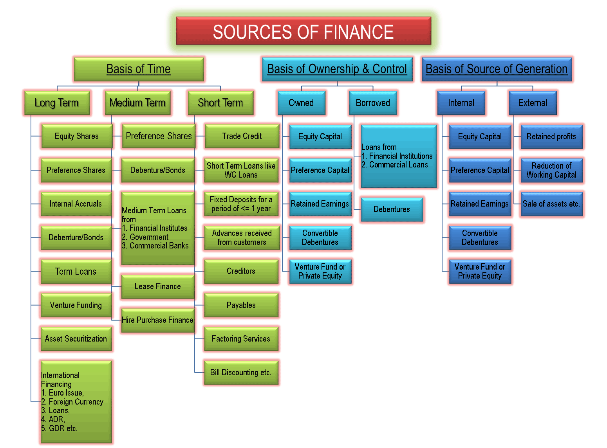

# Sources of Funds for Business

Money is the lifeblood of any business, and it's essential for its smooth operation and growth. The funds required to run a business are known as business funds. Businesses need funds continuously throughout their lifespan for various activities. Sources of funds are categorized based on several factors, including the time period, ownership and control, and their source of generation.

## Classification of Sources of Funds

### Based on Time Period:

1. **Long-Term Sources:** These are funds that are required for the long-term needs of the business. They typically have a maturity period of more than one year. Examples include equity shares, debentures, long-term loans, and retained earnings.

2. **Short-Term Sources:** Short-term funds are needed to meet the day-to-day operational requirements of the business. They have a maturity period of one year or less. Examples include bank overdrafts, trade credit, and short-term loans.

### Based on Ownership and Control:

1. **Ownership Capital:** These funds come from the owners of the business. They include equity capital, which represents the ownership stake of shareholders in the company. Owners' capital does not have to be repaid, but shareholders expect returns in the form of dividends and capital appreciation.

2. **Borrowed Capital:** Borrowed funds are obtained by the business through loans or other debt instruments. These funds must be repaid along with interest. Examples include bank loans, debentures, and bonds.

### Based on Source of Generation:

1. **Internal Sources:** These funds are generated from within the business itself. They do not involve external parties. Examples include retained earnings (profits reinvested in the business), depreciation, and the sale of assets.

2. **External Sources:** External sources of funds involve raising capital from external parties. These sources can be further categorized as:
   - **Equity Sources:** Funds raised by issuing equity shares to shareholders.
   - **Debt Sources:** Funds obtained through loans, debentures, or bonds.
   - **Hybrid Sources:** A combination of equity and debt financing.

Understanding the classification of sources of funds is crucial for businesses to make informed decisions about how to raise and utilize capital effectively. The choice of funding sources can significantly impact the financial structure and health of the business.

In summary, sources of funds are vital for the functioning and growth of businesses. They are categorized based on factors such as the time period, ownership and control, and their source of generation, allowing businesses to tailor their financing strategies to meet their specific needs and objectives.
