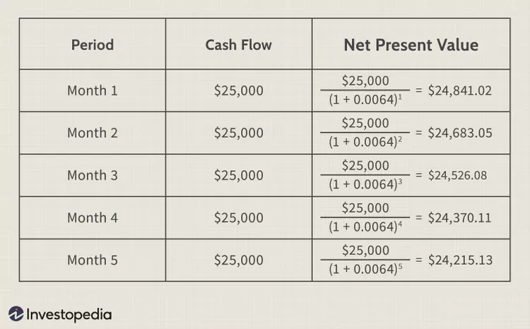

# Net Present Value (NPV) Method
---

### Note:
**This section provides a conceptual overview of NPV. It is recommended to practice solving NPV problems independently to gain a better understanding of the topic.**

---

Net Present Value (NPV) is a crucial financial metric used in capital budgeting and investment planning. It helps in assessing the profitability of a proposed investment or project. 

**NPV Formula**: NPV = -Initial Investment + Sum of discounted CFs over 60 periods

**Definition**:

NPV is the calculation of the difference between the present value of cash inflows and outflows over a period of time.
It is used to evaluate the worthiness of an investment or project.

## How NPV Works
- **Calculation Basis**: NPV involves finding the current value of future cash flows, discounted at an appropriate rate.
- **Positive vs. Negative NPV**:
     * **Positive NPV**: Indicates that the projected earnings (discounted to present value) are greater than the current cost of the investment. Investments with a positive NPV are typically seen as favorable and likely profitable.
     * **Negative NPV**: Suggests that the present value of future cash outflows exceeds the inflows. Such investments are generally not considered profitable.

## What NPV Indicates
- **Time Value of Money**: NPV incorporates the time value of money, acknowledging that a dollar today is worth more than a dollar in the future due to its earning potential.
- **Comparative Analysis**: It allows for comparison between different investment opportunities or against a required rate of return (hurdle rate).
- **Discount Rate**: A key component in NPV calculation, representing the minimum rate of return expected from an investment. This rate factors in the risk profile of the investment and the opportunity cost of capital.

## Discounted Cash Flow (DCF) Analysis
- In corporate finance, NPV calculations are often referred to as Discounted Cash Flow (DCF) analysis.
- DCF is a method to value a company or project based on its future cash flows, discounted back to their present value.
- Renowned investors like Warren Buffett use DCF to compare the NPV of a company’s future cash flows with its current market price.

## The Importance of the Discount Rate
- The discount rate reflects the opportunity cost of capital and the risk associated with the investment.
- It accounts for inflation and the fact that money has a higher value today than in the future.
- The rate should be higher for riskier investments compared to safer options like government bonds.

**When to Use NPV**

- **Positive NPV Investment**: Indicates profitability and value creation.
- **Negative NPV Investment**: Likely to result in a net loss and is generally not recommended.

## Scenario Overview
- **Investment in Equipment**: $1,000,000
- **Monthly Revenue**: $25,000 for 5 years
- **Alternative**: Securities with 8% annual return

### Step 1: NPV of Initial Investment
- **Initial Investment**: -$1,000,000
- No discount applied for initial outlay.

### Step 2: NPV of Future Cash Flows
- **Number of periods (t)**: 60 months (5 years * 12 months)
- \textbf{Discount Rate ($i$)}: Monthly rate = (1 + Annual rate)^(1/12) - 1 = (1 + 8\%)^(1/12) - 1 = 0.64\% (converted from 8% annual)

### Cash Flow Calculation
- **Monthly Cash Flow**: $25,000
- **Present Value Formula**: PV = CF / (1 + i)^t

### Total NPV Calculation
- **NPV Formula**: NPV = -Initial Investment + Sum of discounted CFs over 60 periods
- **Simplified**: NPV = -$1,000,000 + $1,242,322.82 = $242,322.82

### Conclusion
- Positive NPV of $242,322.82 suggests the equipment purchase is financially favorable.

NPV is a vital tool for financial decision-making, helping businesses and investors assess the viability and profitability of potential investments by considering the time value of money and the opportunity cost of capital.
