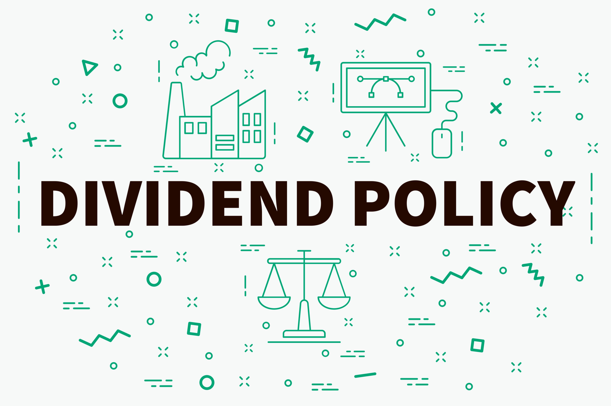

# Dividend Policy: Meaning and Types

Dividend policy refers to the set of guidelines, strategies, and decisions a company makes regarding the distribution of profits to its shareholders in the form of dividends. This policy outlines how much of the company's earnings will be paid out to shareholders and how frequently these payments will be made. The primary objective of dividend policy is to strike a balance between rewarding shareholders and retaining earnings for reinvestment in the business.

{ width=50% align=center }

**Importance of Dividend Policy**

- To meet investors' preference for dividends.
- To improve the market price of shares.
- To improve the image of the company in the market.
- To attract prospective investors.

<!-- center the image -->

## Forms of Dividend

1. **Cash Dividend**: A cash dividend is a distribution of cash to shareholders as a form of dividend payment. It is the most common type of dividend and is usually paid out of the company's earnings.

2. **Stock Dividend**: A stock dividend is a distribution of additional shares of stock to existing shareholders. Instead of cash, shareholders receive additional shares in proportion to their existing holdings.

3. **Bond Dividend**: A bond dividend is a distribution of bonds to shareholders. This type of dividend is less common and is usually used when a company wants to reward shareholders with fixed-income securities.

4. **Property Dividend**: A property dividend is a distribution of assets, such as real estate or equipment, to shareholders. This type of dividend is rare and is typically used when a company wants to divest certain assets.

5. **Scrip Dividend**: A scrip dividend is a distribution of promissory notes or certificates that entitle shareholders to receive additional shares or cash at a later date. This type of dividend is often used when a company wants to conserve cash.

6. **Final Dividend**: A final dividend is a dividend paid at the end of a financial year. It is usually paid after the company's annual financial statements have been prepared and approved.

7. **Interim Dividend**: An interim dividend is a dividend paid during the financial year before the final dividend is declared. It is usually paid out of the company's interim profits.

## Types of Dividend Policy

### 1. Regular Dividend Policy:

In a regular dividend policy, a company aims to maintain a consistent and predictable pattern of dividend payments. This means that shareholders can expect to receive dividends at regular intervals, such as quarterly or annually. Companies with stable and steady cash flows often adopt this policy. The primary advantage is that it provides shareholders with a reliable income stream, which can attract long-term investors. However, it can limit the company's flexibility to reinvest profits.

### 2. Stable Dividend Policy:

Similar to regular dividend policy, a stable dividend policy maintains a relatively consistent dividend payout over time. However, it allows for minor fluctuations in dividend amounts, typically due to variations in earnings. This policy is often seen as a compromise between the regular dividend policy and the irregular dividend policy. It provides a degree of stability while allowing the company to adjust dividends in response to changing financial conditions.

### 3. Irregular Dividend Policy:

In an irregular dividend policy, the company does not follow a set pattern for dividend payments. Instead, it pays dividends based on its earnings, cash flow, and capital requirements. This policy is more flexible and responsive to the company's financial situation. It may result in higher dividends during prosperous periods and lower or no dividends during challenging times. Irregular dividend policies are common among cyclical industries or companies with volatile earnings.

### 4. No Dividend Policy (Zero Dividend Policy):

Under a no dividend policy, the company retains all of its earnings and reinvests them back into the business. This means that shareholders do not receive any dividends. Companies that are in a growth phase or have substantial investment opportunities often adopt this policy. The rationale is that reinvesting profits can lead to higher capital appreciation, which can ultimately benefit shareholders in the form of capital gains.

The choice of dividend policy depends on a company's financial stability, growth prospects, and the preferences of its shareholders. It's important for companies to communicate their dividend policy clearly to investors, as it can influence their investment decisions and expectations regarding income and capital appreciation.