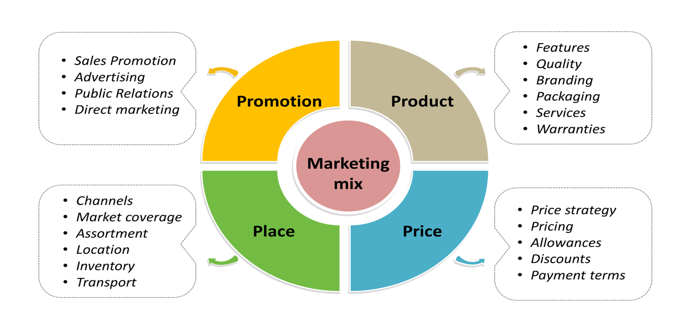

# Concept of Marketing Mix

The marketing mix is a fundamental concept in marketing strategy. It involves strategically blending four key elements to achieve marketing success. These elements are about delivering the right product or service, in the right place, at the right time, and at the right price. The marketing mix provides a structured framework for businesses to create effective marketing strategies, ensuring they meet their target audience's needs and achieve their marketing goals.

## The Four Ps of Marketing

The marketing mix consists of four essential elements, often referred to as the "Four Ps of Marketing." These elements have been a cornerstone of marketing theory for over 50 years, and while some argue that they might be somewhat outdated in today's rapidly evolving marketing landscape, they still offer a practical framework for prioritizing various aspects of your marketing strategy.

### 1. Product

The first "P" in the marketing mix stands for "Product." This element represents the product or service that your business offers to its target audience. The nature of the product can vary significantly based on the type of company and its industry. For instance, it could be a tangible product like a smartphone or a service like ride-sharing.

Understanding your product is essential, and several questions should be considered:

- What are the specific features and functions of your product or service?
- How do customers use your product or service in their daily lives?
- What makes your product unique or different from competitors' offerings?
- What benefits do customers gain from using your product or service?
- How is your product branded, and what is its positioning in the market?
- How extensive is your product line, and what is the product architecture?

### 2. Place

The second "P" in the marketing mix represents "Place." It focuses on where and how customers can access and purchase your product. This element has undergone significant changes, particularly with the advent of the internet and e-commerce.

Places where consumers can make purchases include online platforms, retail stores, trade shows, marketplace channels like Amazon, or even through direct sales professionals.

Key considerations for the "Place" element include:

- How do your target customers prefer to shop and make purchases?
- Where can consumers find and buy products similar to yours from competitors?
- Which distribution channels provide a seamless and convenient shopping experience for your customers?
- Do you require sales representatives to assist customers in buying your product?
- Are there opportunities to explore new channels for product distribution?

### 3. Price

The third "P" in the marketing mix is "Price." This element refers to the cost of your product or service and how it's determined. Pricing considerations involve factors such as your competition, demand for the product, production costs, and customer willingness to pay. Pricing strategies can vary widely, from subscription models to one-time purchases.

Key questions to address when setting prices include:

- What is the perceived value of your product or service to consumers?
- How do your prices compare to market averages for similar products or services?
- Is your pricing competitive relative to your competitors?
- What pricing structure aligns best with your business model and goals?

### 4. Promotion

The fourth and final "P" in the marketing mix is "Promotion." Promotion encompasses the strategies and tactics used to reach your target audience with the right message at the right time. It's essentially how you market and advertise your product or service.

Promotion activities can range from organic social media campaigns to comprehensive multichannel marketing efforts. When considering promotion, it's essential to answer questions like:

- Which specific segments of your target audience need to be engaged?
- Where do your customers typically seek information about products or services?
- When is the optimal time to launch your marketing campaigns?
- Which marketing channels offer the most efficient and cost-effective means to reach your target audience?

In summary, the marketing mix is a comprehensive framework that combines the four Ps - Product, Place, Price, and Promotion - to create effective marketing strategies. These elements, when carefully considered and strategically aligned, help businesses meet customer needs, generate demand, and achieve their marketing objectives in today's dynamic business environment.
