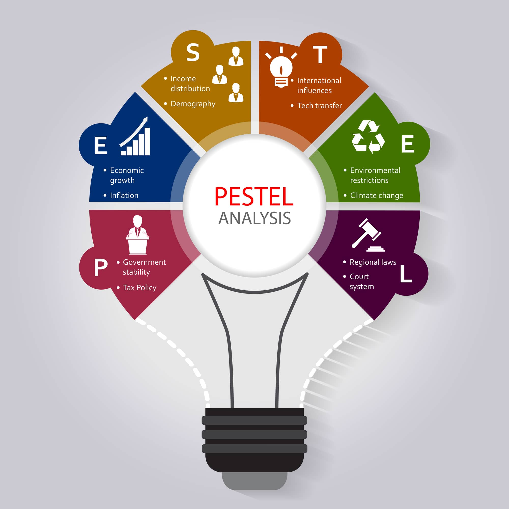

# Marketing Eco-System

The marketing environment plays a pivotal role in shaping an organization's marketing decisions and strategies. It encompasses both internal and external factors that can have a direct or indirect impact on a business's marketing activities. Let's delve into the concepts of microenvironment and macro marketing environment to understand their significance:

## Microenvironment in Marketing

The **microenvironment** refers to the immediate and controllable factors that closely affect a business's marketing operations. These factors are typically internal or closely linked to the organization. Key components of the microenvironment include:

1. **Customers**: Understanding customer needs, preferences, and behavior is essential for tailoring products and marketing strategies effectively.

2. **Suppliers**: Reliable suppliers are crucial for ensuring the availability of necessary resources and materials to support production and meet demand.

3. **Business Partners**: Collaborative relationships with other businesses, such as distributors, retailers, and marketing agencies, can impact marketing efforts.

4. **Vendors**: Vendors who provide marketing services, technology solutions, or other support services directly influence marketing campaigns.

5. **Competitors**: Knowledge of competitors' strategies and market positioning helps in crafting competitive marketing approaches.

Factors within the microenvironment are generally controllable to some extent, allowing businesses to adapt and respond effectively to changes and opportunities.

## Macro Marketing Environment

The **macro marketing environment** consists of factors beyond the immediate control of an organization. These external factors can significantly influence business and marketing operations. The acronym **PESTLE** is commonly used to categorize macro environmental factors:

{width=50% align=center}

1. **P: Political Factors**: Government policies, regulations, stability, and political ideologies can affect market entry, trade, and business practices.

2. **E: Economic Factors**: Economic conditions, including inflation rates, exchange rates, economic growth, and consumer spending, impact purchasing power and market demand.

3. **S: Social and Demographic Factors**: Social trends, cultural values, demographics (e.g., age, gender, income), and lifestyle changes influence consumer behavior and preferences.

4. **T: Technological Advancements**: Rapid technological innovations can disrupt industries, create new opportunities, and change the way products are marketed and delivered.

5. **L: Legal and Regulatory Factors**: Laws, regulations, and compliance requirements can affect marketing practices, product safety, and market access.

6. **E: Environmental Factors**: Growing concerns about environmental sustainability, climate change, and eco-friendly practices are influencing consumer choices and product development.

These macro environmental factors are often uncontrollable, making it essential for businesses to monitor, analyze, and adapt to changes in the external environment. For instance, political shifts or technological advancements can have profound implications for marketing strategies and market dynamics.

In summary, a comprehensive understanding of both the microenvironment and macro marketing environment is crucial for businesses to make informed decisions, develop effective marketing plans, and navigate the complex landscape of the business ecosystem.