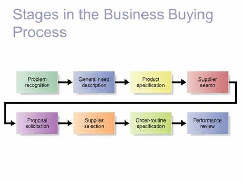

# Business Buying Process

The business buying process consists of several stages that organizations go through when making purchasing decisions. These stages help companies identify and address their needs efficiently. While the process can vary depending on the complexity of the purchase, there are typically eight stages involved.

## Stage 1: Problem Recognition

The buying process begins when someone within the organization recognizes a problem or need that can be addressed by acquiring a specific product or service. This recognition can result from internal or external stimuli. Internal factors may include the need for new production equipment or materials, while external factors could be attending a trade show, seeing an advertisement, or receiving a sales pitch from a supplier.

## Stage 2: General Need Description

After recognizing a need, the buyer prepares a general need description that outlines the characteristics and quantity of the required item. For standard items, this step is straightforward. However, for complex items, collaboration with engineers, users, or consultants may be necessary to define the item's attributes and prioritize factors like reliability, durability, and price.

## Stage 3: Product Specification

In this stage, the buying organization develops the technical product specifications for the required item. This process may involve a value analysis engineering team, which evaluates components to reduce costs. The team decides on the best product characteristics and specifies them. Suppliers can also use value analysis to offer innovative solutions and secure new business opportunities.

## Stage 4: Supplier Search

The buyer conducts a supplier search to identify potential vendors. This can be done through trade directories, online searches, recommendations from other companies, or using the internet. The complexity and cost of the item influence the time and effort spent on supplier research. Suppliers must ensure they are listed in major directories and build a positive reputation in the market.

## Stage 5: Proposal Solicitation

During this stage, the buyer invites qualified suppliers to submit proposals. In response, some suppliers may provide catalogs or engage a salesperson, while others may offer detailed written proposals or formal presentations. Business marketers should excel in researching, writing, and presenting proposals to stand out from competitors.

## Stage 6: Supplier Selection

The buying center reviews the proposals and selects one or more suppliers. Attributes such as quality, on-time delivery, ethical behavior, communication, and pricing influence supplier selection. The number of suppliers chosen varies, with some organizations reducing their supplier base for better management.

## Stage 7: Order-Routine Specification

The buyer prepares an order-routine specification that includes the final order details with the chosen supplier(s). It specifies technical requirements, quantity, delivery times, return policies, warranties, and other relevant terms. 

## Stage 8: Performance Review

In this final stage, the buyer evaluates supplier performance. Feedback may be gathered from users to assess satisfaction. This review can lead to ongoing, modified, or discontinued relationships. Suppliers must monitor factors important to the buyer to ensure customer satisfaction.

The eight-stage model provides a simplified view of the business buying decision process. In reality, the process can be more complex, with variations depending on the organization, the buying situation, and the unique requirements of each purchase. Different participants in the buying center may be involved at different stages, and the process may not always follow a linear path.
