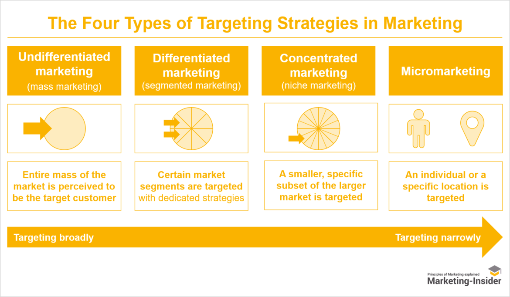

# Market Targeting

Market targeting involves evaluating and defining your target market based on various dimensions, commonly referred to by marketing professionals. These dimensions include:

- **Demographic:** Characteristics such as age, gender, occupation, income, and education.

- **Geographic:** Location and region.

- **Psychographic:** Interests, hobbies, values, attitudes, lifestyle choices.

- **Behavioral:** Past and present decisions.

Identifying the proper personas is a primary challenge in audience targeting. Effective targeting criteria help in defining your target market clearly.

Market targeting encompasses using these dimensions to define your target market and developing strategies to reach your chosen market segment efficiently.

{ width=80%}

## Four Market Targeting Strategies

There are four primary types of market targeting strategies:

### 1. Undifferentiated Marketing (Mass Marketing)

Marketer may not prefer the idea of market segmentation and differentiated marketing. In that case, we will have one marketing-mix for several market segments. The advantage is that there is potential savings on production and marketing costs. As the company would face more specialised competition in each segment, it would have a relatively weak position in all segments. For many years Coca-Cola company followed such a strategy - one brand, one product, one bottle, for one big market. But due to competition from rivals, who adopted differential marketing, even this big giant today has a broad line of products, multisized bottles and now follows differentiated marketing. It has, thus, found new selling appeals. Examples: Undifferentiated, mass marketing of namkeens, biscuits and local soft drinks.

**Benefits:**
- Increased brand awareness and reach.
- Lower costs due to efficiency.
- Reusable adverts.

**Drawbacks:**
- Dependence on scalability.
- High competition.
- Lack of customization.

### 2. Differentiated Marketing (Segmented Marketing)

An organisation, under differentiated marketing strategy, enters many marketing segments but has a unique marketing-mix appropriate for each segment. It wants to do business successfully in several segments. Example: Hindustan Lever has one brand of bath soap for each market segment. An automobile company, e.g., General Motors, offers a car for every 'purpose, purse and personality'. Indian Railways offer second class, first class and AC class accommodation. Each of these classes is targeted at specific segment of the travellers. Such a marketing strategy offers higher sales, and higher customer satisfaction. The firm can develop brand preference and repeat sales. However, differentiated marketing has one disadvantage viz., higher production and higher marketing costs. Hence, increasing market segmentation for the buyer's favour can reach a point of diminishing returns, i.e., additional sales increase may be lower than additional cost increase.

**Advantages:**
- Competitive advantages for various customers.
- Reaching diverse audience types.
- Ability to adjust adverts quickly.
- Efficient distribution channels.

**Disadvantage:**
- Higher cost and effort.

### 3. Concentrated Marketing (Niche Marketing)

A firm may decide to concentrate all available resources on one chosen segment within the total market. It selects a market area where there is no strong competition and it can do best in that area. If it succeeds in matching its resources with customer demand, it may enjoy an element of monopoly in that area. The market niche is free from competition. Strong loyalties are developed as customers are highly pleased with its products. Industrialists, rich businessmen, high profile corporate managers are target customers for expensive cars like BMW, Mercedes and Audi. A publishing house may concentrate only on textbooks, say, on business and economics. Rolex watch company concentrated only on quality and high-priced watches. In concentrated markets we have only one marketing mix. The product line is limited. The firm has some unique competitive advantage. However, it is an 'all-the-eggs-in-one-basket' strategy. It demands innovation in order to ensure customer patronage continuously. Smaller firms can compete successfully against much bigger firms by entering the niche ignored by the bigger rivals. This is also known as "Niche Marketing

**Benefits:**
- Targeting a loyal customer base.
- Less competition.

**Drawbacks:**
- Smaller markets.
- Limited growth opportunities.

### 4. Micromarketing

Micromarketing, also known as individual marketing, is the most highly targeted form of market segmentation. In this strategy, an organization tailors its marketing efforts to individual customers or extremely small groups within a niche market. The focus is on personalization and catering to the specific needs and preferences of each customer.

**Benefits:**
- Reaching highly lucrative customers.
- Efficient resource use.
- Building customer loyalty.

**Drawbacks:**
- Expensive highly targeted ads.
- Requires thorough market research.
- Limited audience reach.
- Lack of scalability.

These targeting strategies are chosen based on the type of product or service and the characteristics of the target audience. Each strategy has its advantages and disadvantages, and the choice depends on the specific marketing goals and resources available.
