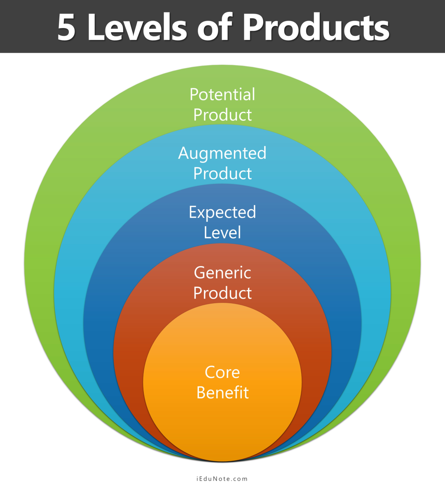
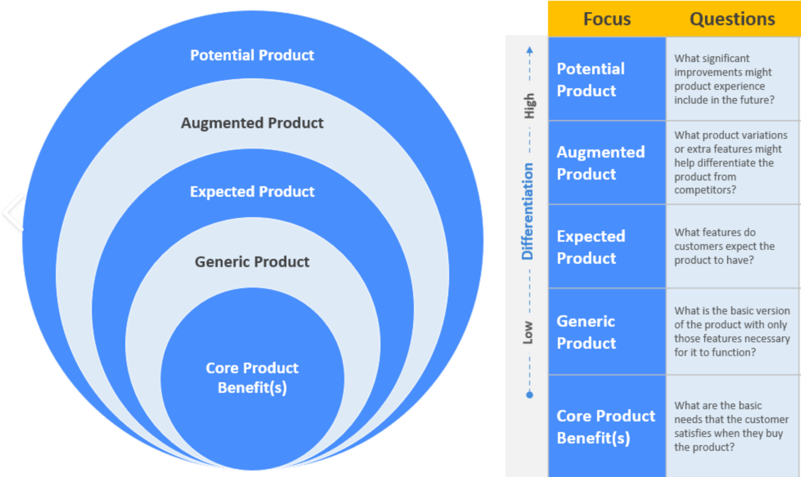

# Product Levels

The product is at the core of the marketing mix, and it plays a central role in determining the success of a marketing campaign. To understand the significance of the product, it's essential to explore the five levels of a product, which help design the actual product and shape the overall marketing mix.

Anything that can be offered to a market to satisfy a want or need which may include physical goods, services, experiences, events, persons, places, properties, organizations, information and ideas. 

<!--  -->

## 1. Core Benefit

At the most fundamental level, the core benefit is what customers seek when purchasing a product. It represents the essential problem the product solves or the need it satisfies. For example, when buying a bar of soap, the core benefit is the product's ability to clean the skin. This level addresses both tangible and intangible benefits.

## 2. Generic Product or Basic Product

The generic product, or basic product, is the second level in the product hierarchy. It comprises the attributes and elements that must be present to convert the core benefit into a basic product. For instance, a calculator includes plastic, metal, electronic circuits, and a liquid crystal display. This level answers the question: "What is the buyer really buying?" It forms the foundation of the total product.

## 3. Expected Product

The expected product level outlines the attributes and conditions that buyers anticipate when making a purchase. Customers expect certain features or benefits, such as ease of use or reliability, from the product. For a calculator, buyers expect it to be handy and user-friendly.

## 4. Augmented Product

The augmented product represents the fourth level and is what customers are truly buying. It includes the core product augmented by additional benefits, features, or services. Modern marketers often compete by enhancing the augmented product to exceed customer expectations. Customers do not merely purchase products; they invest in the expectations of benefits. Marketers should actively recognize and fulfill these expectations.

Augmentation is not without challenges. Customers may come to view augmented benefits as rights over time. Competitors might start offering basic products at lower prices, affecting sales. Marketers must remain vigilant and continually seek ways to augment their products to delight and surprise customers.

## 5. Potential Product

The potential product is the final level and encompasses all possible augmentations and transformations the product might undergo in the future. It looks beyond current benefits to consider future enhancements that could make the product even more desirable. The potential product aims to satisfy customers while also presenting delightful and unexpected features.

Understanding the five levels of a product is crucial for product development and marketing strategies. Each level adds depth and value to the product, ensuring it meets customer needs and preferences while remaining competitive in the market.

Remember that successful marketing involves not only meeting current customer expectations but also anticipating and adapting to future needs and desires.
