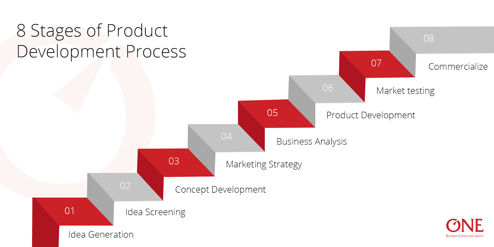

# New Product Development (NPD) Stages

The new product development (NPD) process is a systematic approach to bringing a new product to the market or renewing an existing one. It involves various stages and strategies to ensure the successful creation and launch of a product. Here's an overview of the NPD process:

## 1. Idea Generation

The NPD process begins with idea generation, which involves systematically searching for new product ideas. These ideas can come from both internal and external sources. Internal sources include R&D departments and employee suggestions, while external sources encompass customers, suppliers, and competitors. Collecting a wide range of ideas is essential, as only a few will proceed to the next stages.

## 2. Idea Screening

In the idea screening stage, generated ideas are carefully evaluated to select the most promising ones. The goal is to filter out poor ideas early in the process to avoid wasting resources. Ideas are assessed based on factors such as feasibility, market potential, and alignment with the company's objectives. Early customer feedback, obtained through surveys and focus groups, can be valuable in this stage.

## 3. Concept Development and Testing

### Concept Development

Once promising ideas are selected, they are developed into detailed product concepts. A product concept is a clear and meaningful description of the new product, including its target audience, main features, and intended use. Companies often create multiple product concepts to explore various possibilities.

### Concept Testing

Concept testing involves presenting these product concepts to target consumers, either symbolically or physically. Consumers provide feedback on the concepts, assessing their appeal and perceived value. This stage helps identify which concept resonates most with potential customers and informs further development.

## 4. Marketing Strategy Development

Developing a marketing strategy is a critical step in the NPD process. This strategy outlines the target market, the product's value proposition, sales goals, pricing, distribution, and marketing budget. A well-defined marketing strategy ensures that the product aligns with the company's overall objectives and market positioning.Marketing strategy development-consists of 3 stages 

The first describing the size, strucuture and behaviour.

The second part outlines the products planned pricing and distribution strategy and 

The third part says about the long-run and profit goals 

Strategy statements describe:

- The target market, product positioning, and sales, share, and profit goals for the first few years.

- Product price, distribution, and marketing budget for the first year.

- Long-run sales and profit goals and the marketing mix strategy.

## 5. Business Analysis

Once the best product concept is picked up, it will be subjected to rigorous scrutiny to evaluate its market potential, capital investment, rate of return on capital, etc. Business analysis is a combination of marketing research, cost benefit analysis and assessment of competition. We have demand analysis, cost analysis (including social costs) and profitability analysis. Business analysis will prove the economic prospects of the new product concept. It will also prove soundness and viability of the selected product concept from business viewpoint. Now we can proceed to concentrate on product development programme. The proposed product must offer a realistic profit objective. Profitability can be determined by Break-even Analysis or Discounted Cash Flow method.

## 6. Product Development

With a viable concept and marketing strategy, the product development phase begins. During this stage, the product concept is transformed into a physical product. R&D departments work on prototypes, designs, and testing to ensure the product's feasibility and performance. Customer involvement and feedback may continue to guide development.

We have three steps in this stage, when a paper idea is duly converted into a physical product:
(a) prototype development giving visual image of the product,
(b) consumer testing of the model or prototype,
(c) branding, packaging and labelling. Consumer testing of the model products will provide the ground for final selection of the most promising model for mass production and mass distribution.

## 7. Market Testing

Test marketing allows companies to test the product and its entire marketing program in a realistic market setting. It provides insights into how the product will perform before a full-scale launch. Companies can refine their targeting, positioning, advertising, distribution, and packaging based on test results. The extent of test marketing varies based on factors like risk and market conditions.

Once the management is satisfied with the products functional performance,the product is ready with a brand name
The purpose of test marketing is to learn how consumers and dealers react to handling,using and repurchasing the actual product
- Standard test markets
- Controlled test markets
- Simulated test markets

## 8. Commercialization

The final step in the NPD process is commercialization, which involves introducing the new product to the market. This phase requires significant investments, such as manufacturing facilities, advertising, and sales promotion. Key considerations include timing and market introduction. Companies may choose to roll out the product gradually, regionally, or internationally based on their capabilities and market conditions.

Successfully navigating the NPD process is essential for product innovation and market competitiveness. It requires careful planning, customer engagement, and strategic decision-making at each stage to bring a new product to market effectively.

