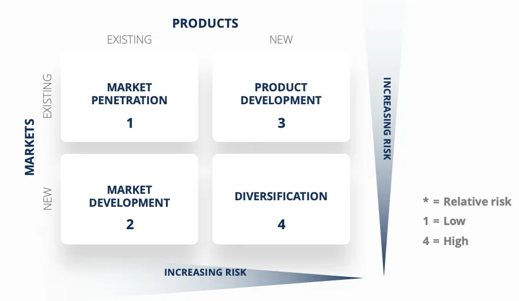

# Ansoff Matrix

The Ansoff Matrix, also known as the Product/Market Expansion Grid, is a strategic framework developed by H. Igor Ansoff in 1957. It is widely used by management teams and analysts to plan and evaluate growth strategies for businesses. This matrix helps in assessing the level of risk associated with different growth initiatives. The Ansoff Matrix is often used in conjunction with other strategic analysis tools like PESTEL, SWOT, and Porter's Five Forces to provide a comprehensive view of business growth prospects.

## Understanding the Ansoff Matrix

The Ansoff Matrix is a fundamental concept taught in business schools worldwide. It provides a straightforward and intuitive way to visualize growth strategies. The matrix has two axes: Products on the X-axis and Markets on the Y-axis.

The term "markets" in the Ansoff framework can refer to various aspects, such as geographical regions or customer segments. Here's a breakdown of the matrix:

- **Market Penetration:** This strategy involves increasing sales of existing products in existing markets. It is considered the least risky strategy relative to the others.

- **Market Development:** Market development focuses on selling existing products in new markets. While it is less risky than some strategies, it still requires some adaptation to cater to new customer segments or regions.

- **Product Development:** This strategy aims to introduce new products to existing markets. It often involves investment in research and development (R&D) to create innovative offerings.

- **Diversification:** Diversification is the riskiest strategy as it involves entering entirely new markets with new products. There are two types of diversification:

  - **Related Diversification:** Involves seeking synergies between the existing business and the new product/market.
  
  - **Unrelated Diversification:** Entails entering new markets or industries with limited potential for synergy with the current business.

## Market Penetration

Market penetration is the least risky growth strategy. When employing this strategy, a company aims to increase sales of its existing products within markets it is already familiar with. Here are common execution strategies for market penetration:

- Increasing marketing efforts or streamlining distribution processes.
- Lowering prices to attract new customers within the existing market segment.
- Acquiring competitors in the same market to gain market share.

For example, a consumer packaged goods business selling to grocery chains may adjust pricing to secure more shelf space not only for its existing products but also for additional product lines, such as pet food.

## Market Development

Market development is the next least risky strategy, as it leverages existing products in new markets. This strategy can involve:

- Targeting different customer segments or demographics.
- Expanding regionally within the domestic market.
- Expanding internationally into foreign markets.

For instance, a popular athleisure brand like Lululemon may decide to expand aggressively into the Asia Pacific market, introducing its already successful products to a new geographic region.

## Product Development

Product development focuses on increasing market share within an existing market by introducing new products. This strategy may include:

- Investing in R&D to create entirely new products.
- Acquiring rights to produce and sell products developed by other firms.
- Branding and marketing white-label products produced by third parties.

For example, a beauty brand targeting women aged 28-35 might invest in developing a new line of hair care products to capitalize on its existing customer base's loyalty.

## Diversification

Diversification is the highest-risk strategy, requiring both new products and new markets. Despite its risks, it offers the potential for significant rewards. There are two types of diversification:

1. **Related Diversification:** Involves seeking synergies between the existing business and the new product/market. For instance, a shoe manufacturer might start producing leather car seats, benefiting from shared raw materials.

2. **Unrelated Diversification:** In this approach, the new product/market is unlikely to have synergies with the existing business. For example, the same shoe manufacturer might enter the consumer packaged goods industry to reduce reliance on the cyclical high-end shoe market.

In summary, the Ansoff Matrix provides a clear framework for businesses to assess and choose growth strategies based on their risk tolerance and objectives. Each quadrant of the matrix represents a distinct approach to expanding a company's market presence or diversifying its offerings. Successful growth strategy decisions are typically based on careful analysis and alignment with the company's overall goals and capabilities.