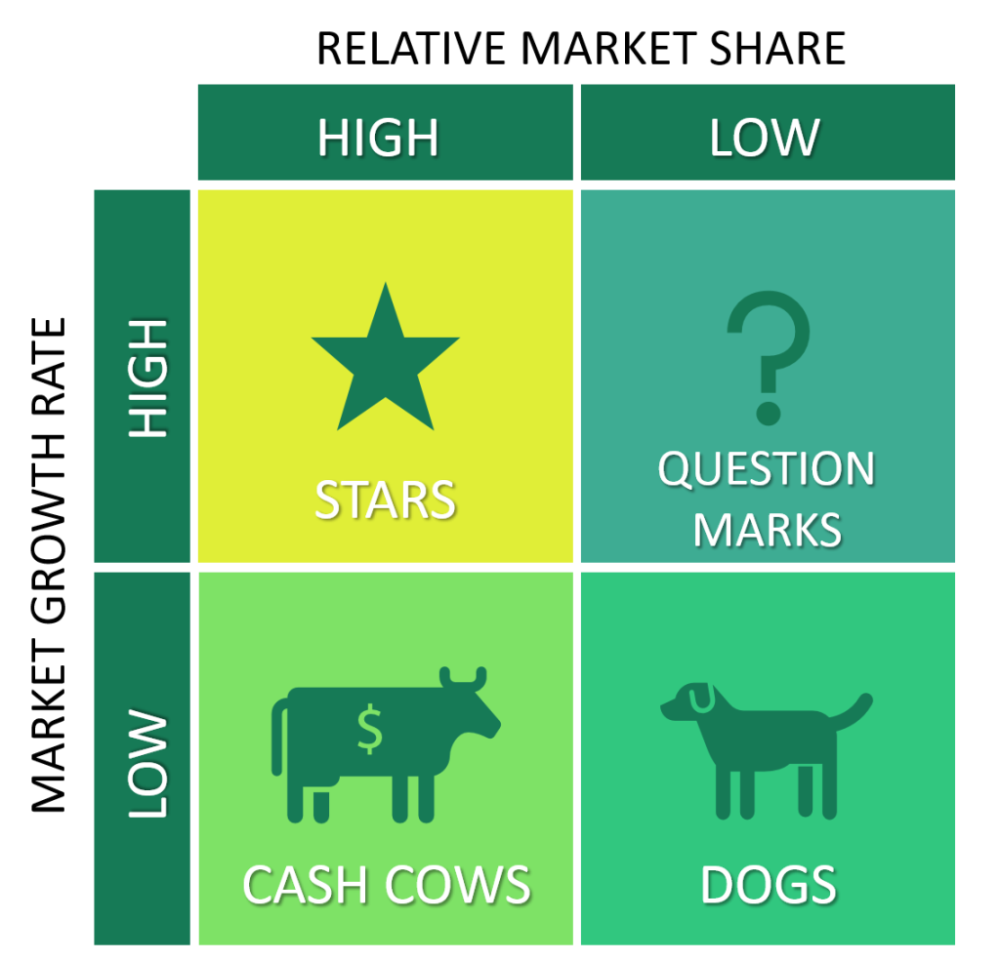

# BCG Matrix / Growth-Share Matrix
The BCG Analysis, developed by the Boston Consulting Group, is a framework that assesses different segments of a business unit based on market growth and cash generation. It classifies these segments into four categories:

## Stars

Stars represent business segments characterized by rapid market growth and a significant market share. These segments generate increasing cash for the business over time due to their strong market presence and growth potential. An example of a "star" is Cera Sanitaryware, which holds a substantial market share, experiences continuous growth, and generates significant cash flow.

## Cash Cows

Cash cows are business segments that require minimal cash investment to maintain their market shares. They are typically in markets with low growth prospects but consistently generate cash due to their well-established market presence. Navneet Publications, a company in the books and notebooks industry, is a prime example of a "cash cow." With a strong brand name, an extensive distribution channel, and a ready market, it sustains steady cash flows. Colgate is another classic example of a cash cow.

## Question Marks

Question marks denote business segments operating in fast-growing markets but with relatively low market share. While these segments have growth potential, they often require substantial investments to increase market share. This investment may consume cash, making them a riskier category. Tata Nano serves as an example of a question mark that did not succeed, whereas Bajaj Pulsar is a question mark product that successfully captured market share.

## Dogs

Dogs are business segments characterized by slow growth rates and intense competitive dynamics, resulting in low cash generation. These segments are less attractive due to their limited growth potential and diminished cash flow. Businesses operating in dog segments often face challenges in generating significant returns. 

The BCG matrix helps investors and businesses assess the attractiveness of different segments based on market growth and cash generation, enabling strategic decision-making and resource allocation.
