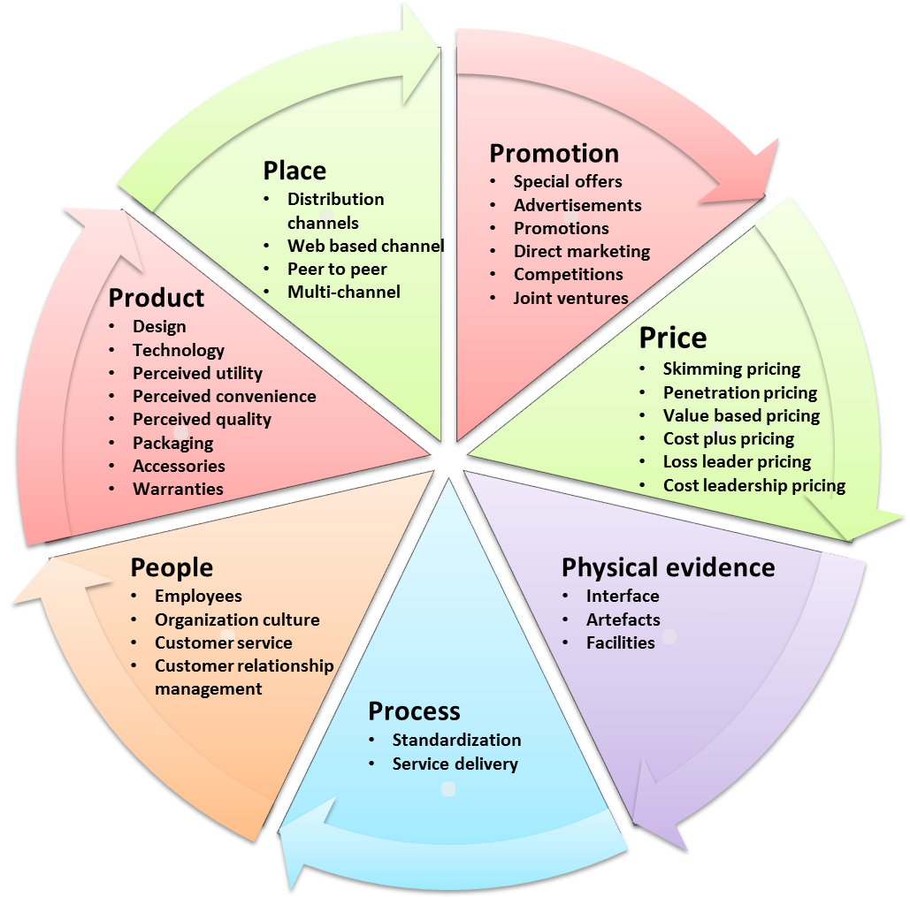

# 7P's of Service Marketing
Service marketing focuses on bringing intangible benefits to customers, or benefits that they can't see, touch or feel. Professionals use service marketing to build loyalty and maintain long-term relationships with customers.

Service marketing differs from product marketing because it allows customers to personalize services based on their needs and receive them by meeting the service provider in person. Typically, the customer can begin using the service immediately upon purchase. Service marketers often persuade their target audiences and increase sales by using a framework called the seven Ps of service marketing, a set of best practices that builds upon the four Ps of product marketing.

## **1. Product (Service)** 
In services marketing, the 'product' is intangible, heterogeneous (varies from customer to customer), and perishable. Services are produced and consumed simultaneously. Customization is often necessary to meet individual customer requirements while maintaining service quality standards. Striking the right balance between customization and standardization is essential in designing service offerings.

## **2. Pricing**  
Pricing services is more complex than pricing tangible goods. Service pricing must consider not only raw material costs but also labor, overhead costs, and profit margins. For example, a restaurant not only prices its food but also factors in costs for the ambiance and service. The final price reflects a markup for a reasonable profit margin.

## **3. Place**  
Since services are delivered at the same time they are produced, the location of service delivery is crucial. Businesses must strategically choose where to offer their services based on customer proximity and convenience. For example, a fine-dining restaurant thrives in a busy, upscale market compared to an isolated location on the outskirts of a city.

## **4. Promotion**  
Promotion plays a vital role in differentiating service offerings, especially when services can be easily replicated. Service providers invest heavily in advertising and marketing to create a distinct brand image and attract customers. In competitive industries like airlines, banks, or insurance, effective promotion helps distinguish nearly identical service offerings.

## **5. People**  
People are integral to service delivery, as services are inseparable from the individuals providing them. Customer interactions with service staff significantly influence the overall service experience. Organizations prioritize customer service training to ensure staff competence and enhance the quality of service. For example, a bank's reputation is shaped not only by its services but also by the interactions customers have with its employees.

## **6. Process**  
The service delivery process is critical in maintaining consistency and ensuring that customers receive a standardized service experience. Many companies create service blueprints that outline the entire service delivery process, including specific steps, scripts, and procedures to be followed by service staff. This helps maintain service quality and efficiency, such as ensuring that a fast-food restaurant consistently delivers orders accurately and promptly.

## **7. Physical Evidence**  
Services being intangible, service providers often incorporate tangible elements to enhance the customer experience. Physical evidence adds a sense of tangibility and credibility to the service. For instance, a hair salon might create a pleasant waiting area with comfortable seating and magazines, contributing to a relaxing atmosphere. Similarly, restaurants invest in interior design and decorations to create a unique and tangible ambiance for their guests, enhancing their overall dining experience.

These 7Ps collectively form the framework for services marketing, addressing the unique characteristics and challenges of marketing intangible services effectively.