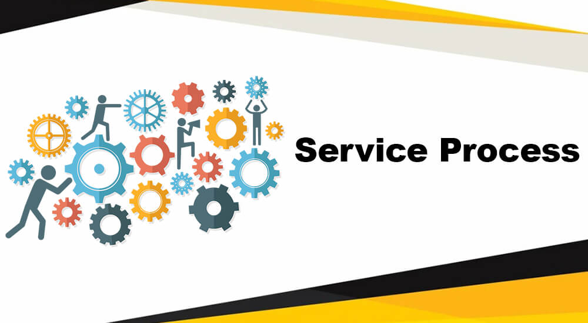

# Service Delivery Process: A 7-Step Approach

Effective service delivery is a critical aspect of providing exceptional customer experiences. To ensure the smooth and efficient delivery of services, businesses often follow a structured approach consisting of seven key steps. These steps help in optimizing processes, identifying potential issues, and enhancing overall service quality. Here's a breakdown of the 7-step service delivery process:

## 1. Flowcharting

Flowcharting involves creating a visual representation of the service delivery process. This step helps in mapping out the sequence of activities, interactions, and touchpoints involved in delivering a service. By visualizing the process, businesses can identify bottlenecks, redundancies, and opportunities for improvement. It serves as a foundational step for understanding the entire service journey.

## 2. Service Blueprinting

Service blueprinting is a more detailed extension of flowcharting. It provides a comprehensive view of the service delivery process, including both frontstage and backstage activities. Frontstage activities are those directly visible to customers, while backstage activities are the behind-the-scenes operations. Service blueprinting helps in understanding the interdependencies between various components of the service and ensures a holistic view of the process.

## 3. Identify Failure Points

Identifying failure points is a crucial step in service delivery. It involves pinpointing areas in the process where things can go wrong, leading to service failures or disruptions. This proactive approach allows businesses to anticipate potential issues and take preventive measures to mitigate risks. Failure points can range from technical glitches to communication breakdowns and resource constraints.

## 4. Failure Proofing

Once failure points are identified, the next step is to implement failure-proofing measures. This involves designing safeguards, redundancies, and contingency plans to minimize the impact of potential failures. By having backup systems and processes in place, businesses can ensure uninterrupted service delivery, even in the face of unforeseen challenges.

## 5. Setting Service Targets

Setting clear service targets is essential for maintaining quality and consistency. Businesses need to establish performance metrics, service level agreements (SLAs), and key performance indicators (KPIs) to measure the effectiveness of their service delivery. These targets serve as benchmarks for evaluating performance and identifying areas that require improvement.

## 6. Service Process Redesign

Service process redesign involves reevaluating and optimizing the service delivery process based on feedback, data analysis, and changing customer needs. It's an ongoing effort to enhance efficiency and effectiveness. Redesign may involve streamlining workflows, adopting new technologies, or revising customer touchpoints to align with evolving expectations.

## 7. Managing Customers Effectively

Effective customer management is at the core of successful service delivery. Businesses must focus on understanding their customers' needs, preferences, and feedback. This step includes implementing customer relationship management (CRM) systems, gathering customer insights, and tailoring services to meet individual customer requirements. Managing customers effectively ensures a personalized and positive service experience.

By following this 7-step service delivery process, businesses can not only provide consistent and high-quality services but also adapt to changing market dynamics and customer expectations. Service excellence is a continuous journey, and these steps contribute to ongoing improvement and customer satisfaction.