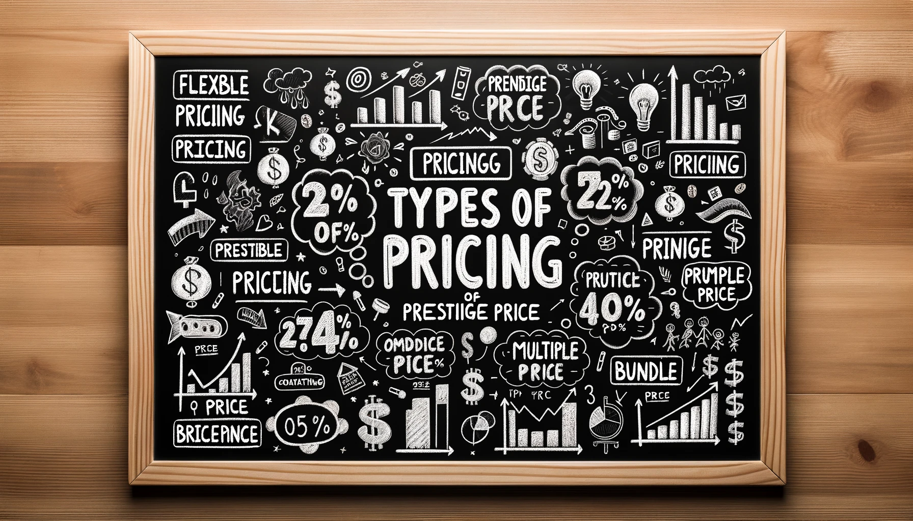
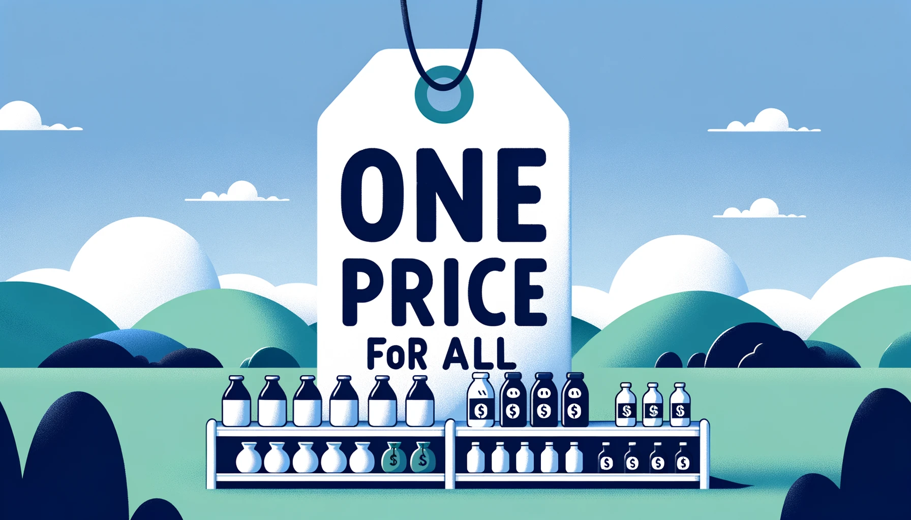
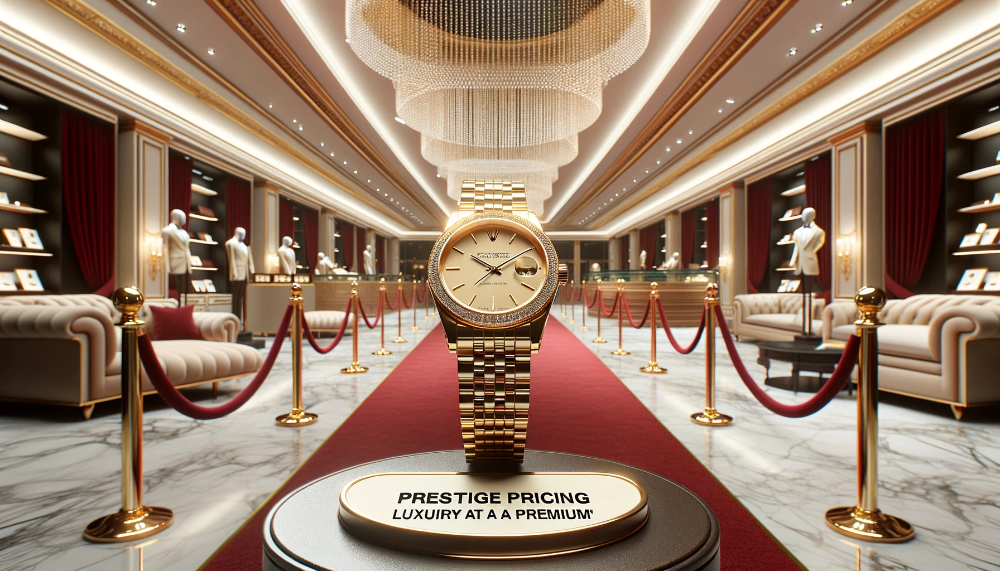

# Types of Pricing

{ width=75%}

## 1. Flexible Pricing
Flexible pricing, also known as dynamic pricing, is a strategy that allows businesses to alter prices in response to market dynamics such as demand, supply, competitor prices, or external events. This pricing model is particularly advantageous in industries where market conditions fluctuate rapidly.

- **Example:** The airline industry is a classic exemplar of flexible pricing. Airlines often adjust ticket prices based on various factors including demand, day of the week, season, and how close the date of travel is. For instance, a flight ticket from Mumbai to Delhi might be priced at INR 3,000 during off-peak hours but may escalate to INR 5,000 during peak hours or as the travel date approaches.

## 2. One-Price

The one-price strategy, also known as fixed pricing, entails setting a steadfast price for a product or service. This price remains consistent regardless of the customer, time of purchase, or other external factors. It simplifies pricing and promotes fairness, which can build customer trust.

{ width=50%}

- **Example:** Retail chains like Walmart often adhere to a one-price strategy. For instance, a bag of rice might be tagged at INR 500, and this price remains constant for all customers irrespective of the purchase time.

## 3. Prestige Pricing

Prestige pricing is a strategy employed to set prices higher than the market average to establish a perception of luxury, exclusivity, or superior quality. This strategy is common among luxury brands and high-end retailers.

{ width=50%}

- **Example:** Luxury watch brand Rolex might price a particular watch model at a lofty INR 500,000 to maintain its prestigious status and attract a niche clientele who are willing to pay a premium for the perceived value and prestige associated with owning a Rolex watch.

## 4. Odd/Even Pricing
Odd-even pricing is a psychological pricing strategy where prices are set at odd or even numbers to appeal to customers in different ways. Odd pricing is perceived as more of a bargain, while even pricing is seen as simpler and more straightforward.

- **Example:** A retailer might price a shirt at INR 999 (odd pricing) to suggest a bargain, as opposed to rounding it off to INR 1,000 (even pricing), which might be perceived as a psychological threshold.

## 5. Multiple Pricing
Multiple pricing involves selling more than one identical item for a single price, often encouraging customers to buy in bulk or purchase more than initially intended.

- **Example:** A supermarket might offer a deal where customers can buy three bottles of ketchup for INR 200. This strategy encourages customers to buy in bulk, perceiving that they are getting a better deal.

## 6. Bundle Pricing
Bundle pricing is a strategy where several products or services are packaged together and sold for a lower price than if they were purchased separately. This strategy can increase the perceived value and encourage customers to spend more to receive a “deal.”

- **Example:** McDonald's often employs bundle pricing by offering meal combos. A meal combo including a burger, fries, and a drink might be priced at INR 250, whereas buying these items separately might cost around INR 300.

## 7. Price Lining
Price lining involves setting a limited number of price points and then categorizing products based on these set prices. This strategy simplifies decision-making for both the retailer and the customer.

- **Example:** A clothing retailer might establish three price points for shirts, such as INR 500, INR 1,000, and INR 1,500. The shirts are then categorized into budget, mid-range, and premium lines, respectively, based on these price points, making it easier for customers to shop based on their budget.

Each of these pricing strategies caters to different market scenarios, business objectives, and consumer perceptions. The selection of a suitable pricing strategy is pivotal as it impacts the business's profitability, market position, and brand perception.