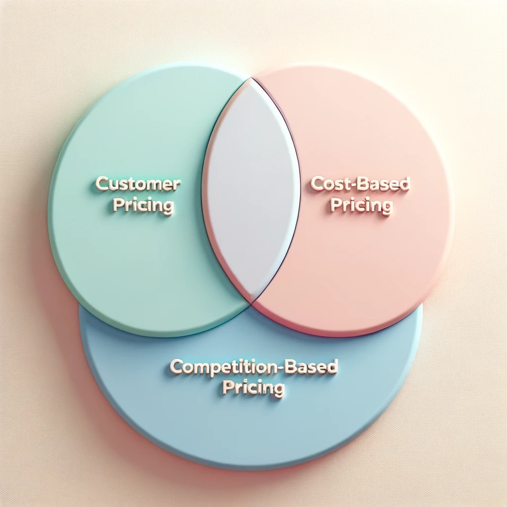

# Pricing Strategies

{ width=75% }

## Customer Value-Based Pricing

Customer Value-Based Pricing is a strategy that determines the price of a product based on the perceived value to the customer rather than on the cost of production or on competitive prices. This pricing strategy often leads to higher prices and margins compared to cost-based pricing. Here are the steps involved in implementing value-based pricing:

### Steps of Value-Based Pricing

1. **Understand Customer Value Perception and Needs:** 
   
     * Understand what customers value in a product or service and what problems they are looking to solve.
   
     * Conduct market research to gather insights on customer preferences and willingness to pay.

2. **Set Target Price to Match Perceived Value:**
   
     * Determine a price that reflects the value perceived by customers.
   
     * The price should be set at a level where customers feel they are getting good value for the money.

3. **Analyze Costs:**
   
     * Analyze the costs involved in creating the product to ensure that the price set will cover costs and yield a satisfactory profit.
   
     * Consider both fixed and variable costs in the analysis.

4. **Create a Product that Matches the Target Value at the Target Price:**
   
    * Design and develop a product that delivers the value perceived by customers at the determined price.
   
    * Ensure that the product meets the quality and features expected by customers at that price point.

## Cost-Based Pricing

Cost-Based Pricing is a pricing strategy where the price of the product is determined by adding a markup to the cost of production. This strategy ensures that all costs are covered and a profit margin is achieved. Here are the types of costs considered:

### Three Types of Costs Considered

1. Fixed Cost
2. Variable Cost
3. Total Cost

## Competition-Based Pricing

Competition-Based Pricing is a strategy where prices are determined based on what competitors are charging for similar products or services. This strategy is common in markets with high competition and where products are relatively homogeneous. The goal is to either match, beat, or even premium price the product relative to competitors based on the market positioning.

1. **Understanding Competitor Pricing:**
   
     * Research and analyze the prices set by competitors for similar products or services in the market.
   
     * Understand the value proposition of competitors and how your product compares to theirs.

2. **Setting the Price:**
   
     * Decide whether to price lower, at parity, or higher than competitors based on your product’s unique value proposition and brand positioning.
   
     * Consider the cost structure and the desired profit margin while setting the price.

3. **Monitoring and Adjusting Pricing:**
   
     * Continuously monitor competitor prices and market reactions.
   
     * Be ready to adjust the pricing strategy as market conditions change, or as competitors change their pricing.

This strategy often requires a thorough understanding of the market, competitor strategies, and a clear positioning of the product in the market to successfully set a competitive price that will also cover costs and achieve desired profit margins.

For a deeper understanding of these pricing strategies, [this article](https://marketing-insider.eu/3-major-pricing-strategies/) provides detailed insights and examples that can help in comprehending and applying these strategies in real-world scenarios.