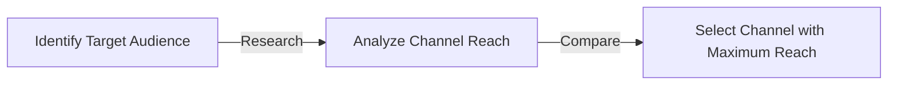
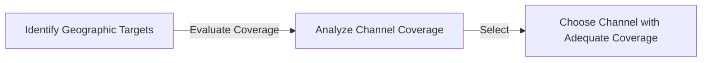
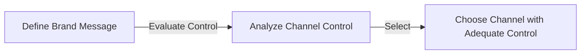
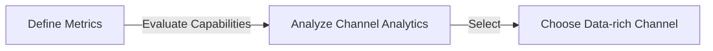

# Selection Criteria for Marketing Channels

Selecting the right marketing channel is pivotal for the effective promotion and distribution of products or services. It necessitates a comprehensive analysis of various factors to ensure that the channel aligns well with the organizational objectives and the preferences of the target audience. Below are the key criteria that should be considered while selecting a marketing channel:

## 1. Target Audience Reach

Reaching the right audience is fundamental for the success of any marketing campaign. The selected channel should have a broad reach to the target demographic to ensure that the marketing messages are effectively conveyed to potential customers.

## 2. Cost-effectiveness

Cost-effectiveness is a crucial consideration to ensure that the marketing efforts yield a favorable return on investment. It's essential to compare the costs involved with different channels and select the one that offers the most value for money.

## 3. Geographic Coverage

The geographic coverage of a channel plays a vital role, especially for businesses that operate in multiple regions or globally. The channel should provide adequate coverage in the targeted geographic areas.

## 4. Compatibility with Product or Services

The compatibility of the channel with the product or service being offered is essential to ensure that the marketing messages resonate well with the audience and enhance the brand perception.

## 5. Control Over Branding and Messaging

Having control over branding and messaging is crucial for maintaining a consistent brand image. The selected channel should allow for the precise delivery of brand messages and creative control over the marketing content.

## 6. Sales and Distribution Support

The channel should provide robust support for sales and distribution to ensure that the products or services reach the customers efficiently.

## 7. Customer Preference

Understanding and catering to customer preferences is crucial for building a strong rapport and ensuring customer satisfaction. It's essential to select a channel that is preferred by the target audience.

## 8. Data and Analytics Capabilities

The ability to track and analyze marketing performance is indispensable for making informed decisions. The selected channel should provide comprehensive data and analytics capabilities to measure the effectiveness of marketing campaigns.