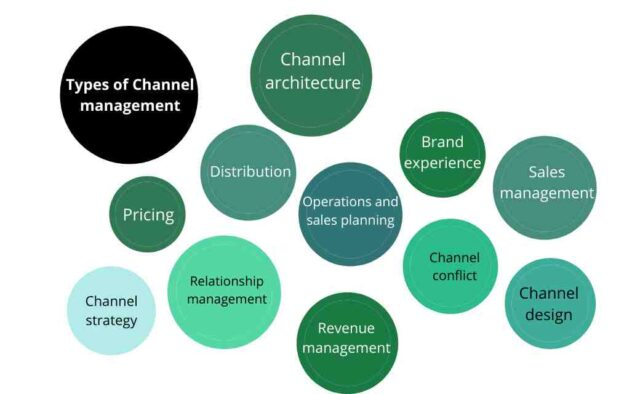

# Channel Management Strategies

Channel Management plays a vital role in sales and marketing, focusing on reaching a broad customer base through various techniques and channels. This document delves into the key strategies involved in effective channel management.

## 1. Channel Architecture Development

Channel architecture refers to the structured pathway your products travel from production to the end customer. It can vary from simple direct-to-customer models to complex systems involving multiple intermediaries.

**Detailed Example:**
- A manufacturer might first send products to a wholesaler, who then distributes them to various retailers, ultimately reaching the customers. Alternatively, a business might sell directly to customers, bypassing wholesalers and retailers.

## 2. Channel Strategy / Channel Design

This strategy is about creating an actionable plan for utilizing sales and distribution channels. It encompasses the selection of channels and plans for market expansion and customer outreach.

**In-depth Example:**
- Tesla exemplifies a direct-to-customer model, selling its products through online platforms and company-owned stores, which helps maintain a direct relationship with customers and eliminates the need for third-party distributors.

## 3. Sales Management

Sales management is a comprehensive approach to handling sales operations and partnerships. It involves setting sales targets, devising incentive schemes, and monitoring performance to ensure alignment with business goals.

**Expanded Example:**
- Consider a company specializing in office air conditioning systems. Their sales management would include strategies for selling units, organizing maintenance services, and managing warranties, along with incentivizing sales teams and engaging customers effectively.

## 4. Channel Conflict

Channel conflict occurs when there is discord or competition among distribution partners, potentially harming sales and customer satisfaction.

**Detailed Strategy:**
- To mitigate this, businesses must frequently reassess their channel strategies to identify and resolve conflicts. This might involve renegotiating terms with partners to balance interests and maintain harmony.

## 5. Relationship Management

This strategy focuses on building and sustaining relationships with third parties like vendors, agents, and retailers. It requires a deep understanding of each party's goals and creating mutually beneficial plans.

**Strategy Insights:**
- Successful relationship management involves aligning business objectives, fostering open communication, and adapting to changes in partner goals or market dynamics.

## 6. Brand Experience

Brand experience is about ensuring a consistent and compelling brand message across all channels. It's essential for brand identity and customer perception.

**Examples and Insights:**
- Amazon and Adidas are notable for their focus on customer experience. Consistent branding and customer-centric strategies help in forging a strong connection with their target audience.

## 7. Pricing

Pricing strategies vary based on where and how customers buy products. Understanding customer expectations and willingness to pay in different channels is crucial.

**Advanced Example:**
- A luxury product might be priced higher in an upscale retail location compared to an online store, reflecting the different customer segments and their purchasing power.

## 8. Sales and Operations Planning

This involves forecasting demand and adjusting production and inventory accordingly. It's critical for aligning sales targets with operational capabilities.

**Elaborate Example:**
- Businesses may ramp up production of certain items during peak seasons, like holidays, based on demand predictions and past sales data.

## 9. Revenue Management

Effective revenue management includes strategies to maximize earnings, such as dynamic pricing and inventory optimization.

**Comprehensive Example:**
- A clothing retailer might offer end-of-season discounts on summer apparel to clear out inventory, making room for the upcoming season's collection.

## 10. Distribution

Distribution management is about efficiently delivering products through different channels, each requiring unique logistical considerations.

**Detailed Example:**
- A business might need distinct distribution strategies for wholesale and direct-to-consumer channels to ensure efficiency and cost-effectiveness.
