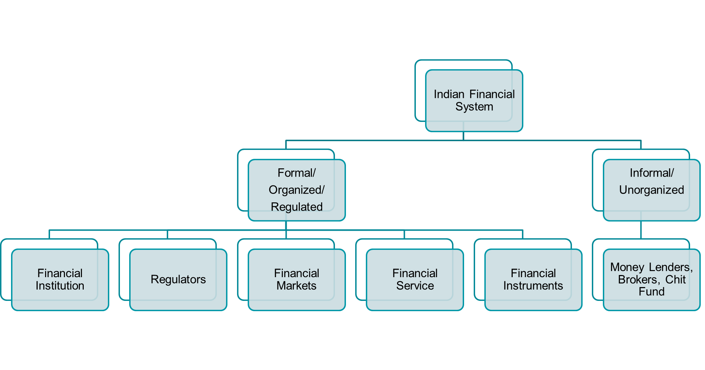
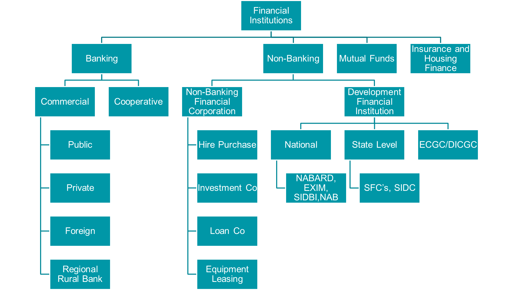
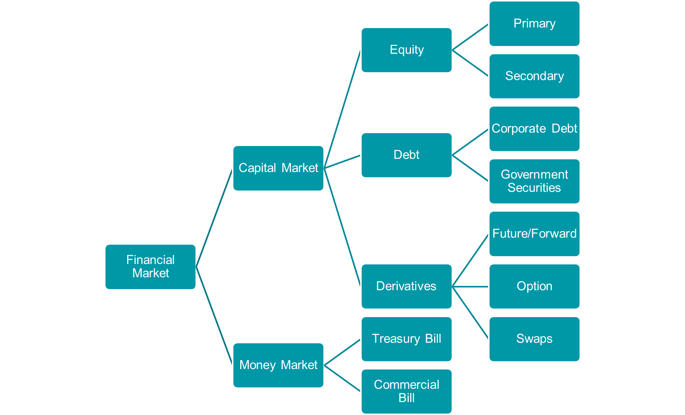

#  Financial System

Its refers to Economic Services provided by various financial institutions that deal with the management of money. it is an in tangible product of financial markes like loans, insurare Stocks, credit card, etc. Financial Services are products of institutions Such as banking firms, insurance Companies, invert funds Credit miens, brokerage firns, and Consumer finance companies.

## Nature of Financial System

- Customer Oriented
- Intangibility
- Inseparable
- Manages Fund
- Financial Intermediation
- Market Based
- Distributes Risk

## Scope of Financial System

## What is a Digital Financial System?
Digital Financial System is a system that allows individuals and businesses to perform financial transactions electronically. It is a subset of the broader digital finance ecosystem, which encompasses all digital technologies that enable financial services and operations.

## Components of a Digital Financial System
1.Financial Institutions

2.Financial Markets

3.Financial Instruments

4.Financial Services

5.Financial Regulations

## Structure Financial Institutions

## Structure Financial Markets

