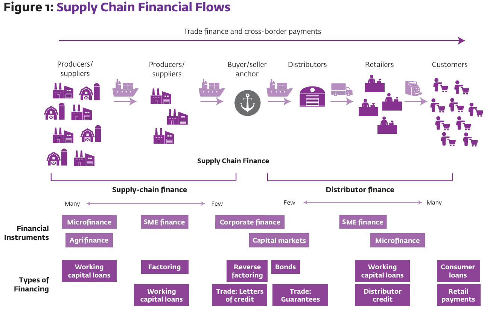

# Digital Financial Supply Chain: Concept and Features

## Supply Chain

The term "supply chain" refers to the network of all the individuals, organizations, resources, activities, and technology involved in the creation and sale of a product. It starts with the delivery of raw materials from a supplier to a manufacturer and ends with the delivery of the finished product to the consumer. The supply chain encompasses the steps it takes to get a good or service from the supplier to the customer.

## Supply Chain Finance

The Supply Chain Finance (SCF) is a set of financial solutions that optimize the cash flow of a supply chain by providing liquidity to suppliers and buyers. It is a form of trade finance that helps companies manage their working capital and improve their cash flow. It is a form of trade finance that helps companies manage their working capital and improve their cash flow.

{width=90%}

## Digital Financial Supply Chain

The "Digital Financial Supply Chain" is an evolution of the financial supply chain that incorporates digital technologies. It aims to enhance the efficiency and transparency of financial transactions in the supply chain through the use of digital tools. This concept is part of the broader digital transformation efforts that many companies are undertaking.

### Features of Digital Financial Supply Chain

1. **Automation**: Digital financial supply chains use software and other technologies to automate many of the financial transactions and processes, reducing the need for manual intervention and speeding up the entire process.

2. **Visibility**: Digital solutions provide real-time visibility into financial transactions, allowing companies to track payments, receipts, and other financial flows more accurately.

3. **Integration**: Digital financial supply chains are often integrated with other business systems, such as Enterprise Resource Planning (ERP) systems, which allows for seamless data flow and better coordination between the financial and physical supply chains.

4. **Instant Payments**: Digital financial supply chains enable instant payments, which can improve cash flow and reduce the risk of late payments.

5. **Optimization**: Digital solutions can help optimize the financial supply chain by identifying bottlenecks and inefficiencies, allowing companies to make data-driven decisions to improve performance.

In simple terms, the Digital Financial Supply Chain is about using technology to make the flow of money and financial information in the supply chain faster, more accurate, and more efficient. It's like upgrading from a manual cash register to a sophisticated financial management software that can handle everything from invoicing to real-time financial analysis. This digital upgrade can lead to cost savings, better cash flow management, and can give a company a competitive edge in the market.