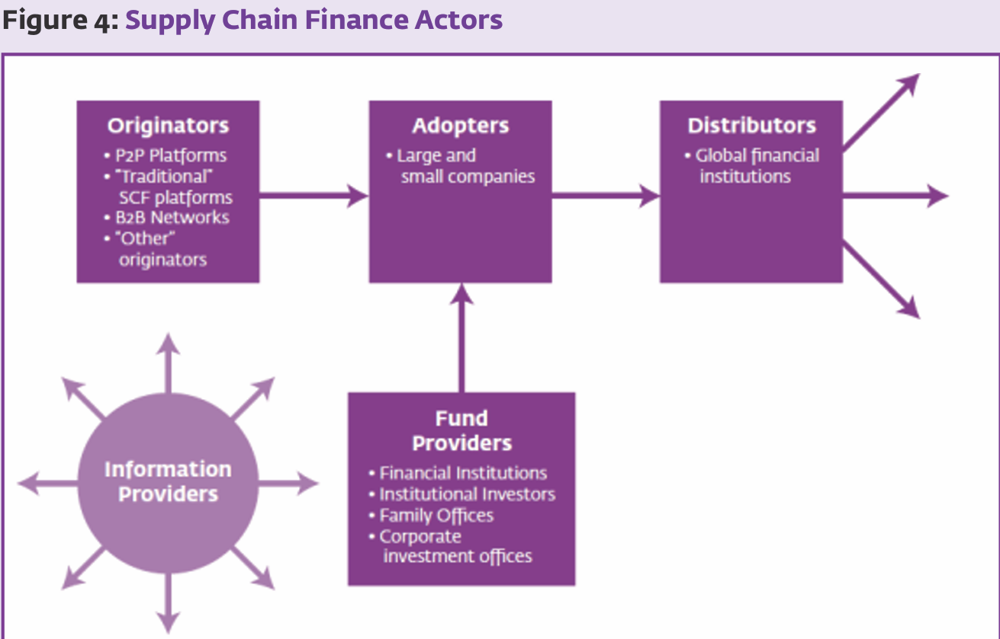
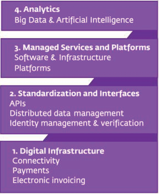

# Supply chain 

## Supply Chain Collaborative Elements
1. **Product**: Sharing consistent data and using common coding systems for the products being traded.

2. **Place**: Centralizing control over the supply chain and reducing the number of indirect suppliers, thus increasing the data exchange and dependency on remaining suppliers.

3. **Time**: Ensuring respect for delivery times and striving to achieve a quick return on investment through product cycles.

4. **Quantity**: Keeping to agreed quantities to maintain trust within the supply chain.

5. **Quality**: Focusing not only on the quality of the product but also on the quality of data exchanged to facilitate an automated flow and digital transformation.

6. **Complexity**: Managing complexity driven by consumer demands for innovation through improved supply chain visibility and strategic management using sophisticated technologies.

7. **Source**: Enhancing the ability to trace the origins of materials and goods, ensuring sustainable sourcing, and adopting practices that support fair trade and responsible production.

8. **Deliver**: Maintaining updated, validated, and secure certification of origin documents, enriched by collaborative information exchange to trace component provenance.

9. **Price**: Establishing mutual interests and compromise between reciprocal objectives, where the price reflects the strength of collaboration.

10. **Cost**: Controlling supply-chain-related costs and addressing unforeseen deviations collaboratively.

11. **Service**: Providing value to customers beyond cost-cutting, with banks assisting corporate clients in navigating new dynamics in internationalization strategies.


## Supply Chain Finance Actors



The above image depicts the key players in Supply Chain Finance (SCF):

- **Originators**: Entities like peer-to-peer platforms, traditional SCF platforms, B2B networks, and other originators that initiate the financing process.
  
- **Adopters**: These are companies, both large and small, that adopt SCF solutions.

- **Distributors**: Include global financial institutions that distribute the financial products.

- **Information Providers**: Central entities that provide data and insights necessary for SCF.

- **Fund Providers**: Financial institutions, institutional investors, family offices, and corporate investment offices that fund SCF programs.


## New Technology Transforming Supply Chain Finance


Digital innovations are making it possible for supply chain finance to broaden its scope, reaching smaller tier 2 and tier 3 sellers or retailers, and lowering costs of financing by leveraging channels, data analytics and processes integrated. There are four areas through which digital innovations have transformed the economics of supply chain finance for financial institutions:



The provided text discusses the transformative impact of various technologies on Supply Chain Finance (SCF):

1. **Digital Infrastructure**: This foundational technology encompasses the connectivity and the electronic systems that facilitate the execution of SCF, including electronic payments and invoicing. It refers to the digital backbone that supports all other technologies, allowing for seamless communication and data transfer.

2. **Standardization and Interfaces**: This relates to the creation of common protocols and interfaces, like APIs, that enable different systems to interact with each other efficiently. It also includes distributed data management and identity verification processes that enhance security and interoperability across the supply chain.

3. **Managed Services and Platforms**: This is about leveraging third-party platforms and services that offer advanced capabilities like cloud computing, distributed ledger technology (DLT), artificial intelligence (AI), and the Internet of Things (IoT). These services can streamline operations, reduce costs, and enhance the scalability of SCF solutions.

4. **Analytics (Big Data & Artificial Intelligence)**: The use of big data analytics and AI provides a deeper understanding of the supply chain by analyzing large datasets to extract meaningful insights. These insights can lead to more informed decision-making, prediction of market trends, and identification of efficiencies or risks within the supply chain. 

This notes that despite the slow permeation of SCF to smaller companies, these technologies are enabling broader access and reducing the costs associated with SCF, which is crucial for including smaller tier 2 and tier 3 sellers or retailers in the financial supply chain.


## Working Capital Management

The Working Capital Cycle (WCC) is crucial for understanding a firm’s operational efficiency and its ability to manage short-term liabilities with short-term assets. Key components of the WCC include:

1. **Days Sales Outstanding (DSO)**: Measures the average number of days a company takes to collect payment after a sale has been made. A higher DSO implies more capital tied up in receivables, which could affect liquidity.

2. **Days Payable Outstanding (DPO)**: Reflects the average time a company takes to pay its own invoices. A longer DPO can benefit a company's cash flow by retaining cash longer.

3. **Days Inventory Outstanding (DIO)**: Indicates the average number of days that a company holds inventory before selling it. This is a critical measure of inventory management efficiency.

```
Working Capital Cycle = DIO + DSO - DPO
```


These indicators help assess how well a company is managing its working capital. They influence a firm's cash flow and can indicate the health of its operational and financial efficiencies. Smaller firms, especially in emerging markets, often face greater challenges managing these components, which can affect their growth and operational capacity.
