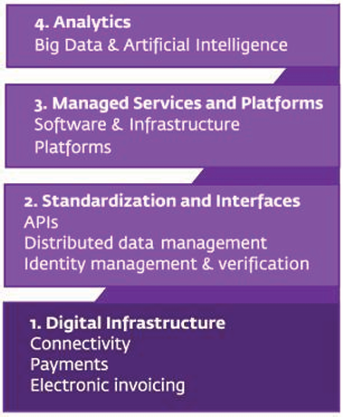
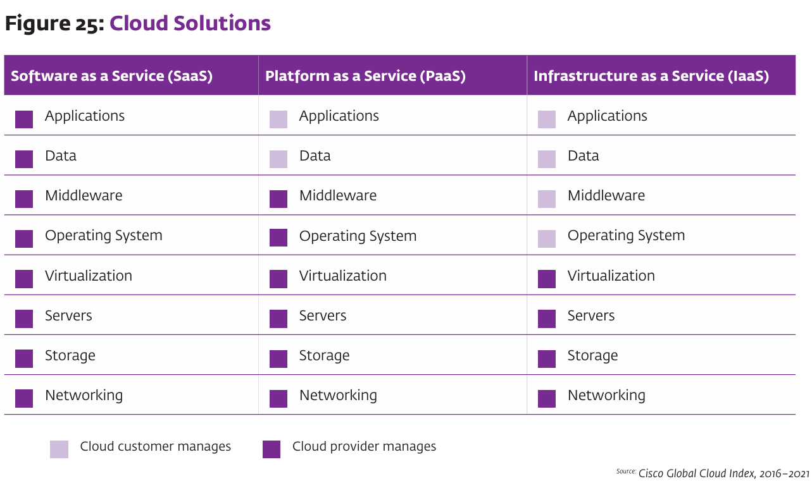
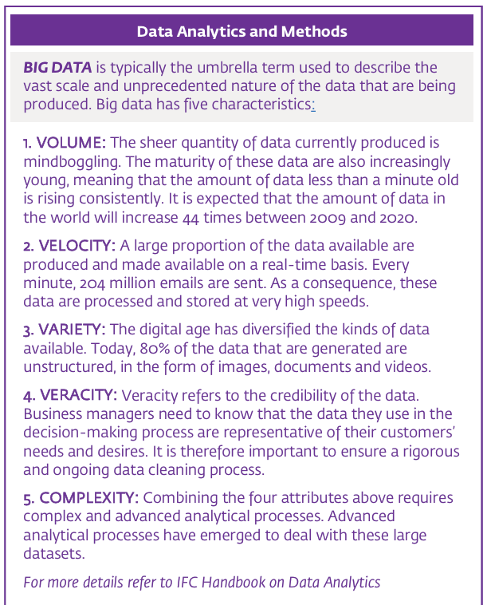
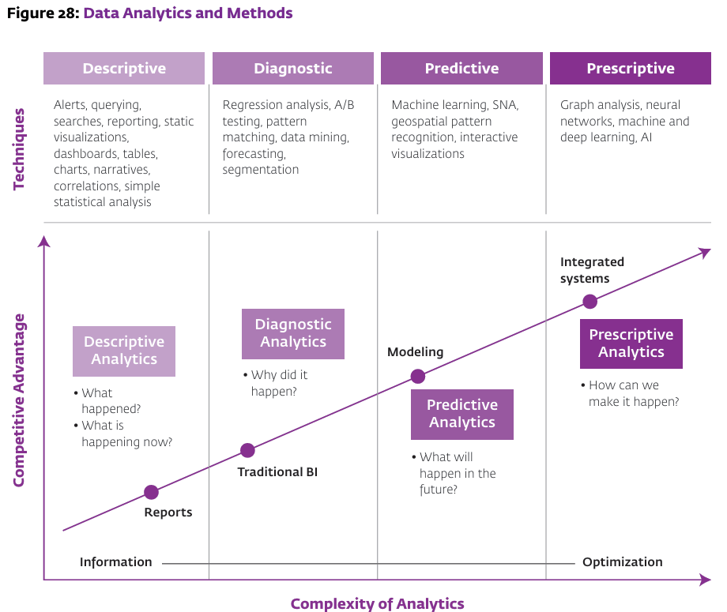

# Technology and Model Innovation

1. **Digital Infrastructure**: Use of smartphones for payments and invoicing, transforming mobile devices into business tools, thus enabling wider financial inclusion and data generation for analysis.

2. **Standardization and Interfaces**: Development of standard APIs and identity management systems to streamline financial operations and enhance security.

3. **Managed Services and Platforms**: Deployment of cloud solutions, AI, IoT, and DLT to reduce inefficiencies in the supply chain.

4. **Analytics**: Application of big data and AI to improve credit scoring and financial service delivery by analyzing transactional data.

## Digital Infrastructure

This details how digital infrastructure is revolutionizing supply chain finance, particularly in emerging markets:

1. **Smartphone Innovations**: Smartphones are increasingly used as point-of-sale terminals and stock scanners, with embedded applications in popular messaging apps facilitating business transactions and financial services.

2. **Payments Digitization**: The shift to digital payments is generating a wealth of data on transactions, which can be leveraged to improve process management and credit scoring while reducing the cost of financial service delivery.

3. **Mobile Financial Services**: Mobile payments provide an infrastructure for low-cost, large-scale transactions, offering financial services even to remote businesses.

4. **Fintech Innovations**: Fintech companies are gaining access to customers traditionally served by mobile operators and financial institutions, driving innovation in supply chain finance.

5. **Working Capital for SMEs**: Digital wallets and targeted financial products like those from Yoco in South Africa are providing SMEs with more accessible financial services and working capital.

6. **Reduced Costs for Lenders**: Electronic invoicing, integrated with accounting software, is streamlining financial requests and allowing for better sales data analysis.

## Standardization and Interfaces

### API Models

APIs, or Application Programming Interfaces, are typically categorized into three types:

1. **Public APIs**: Openly available for wider external use, either free or through subscription models. They are often used by FinTechs to provide services to a broad customer base.

2. **Private or Partner APIs**: Restricted to specific partners, often under a contractual agreement. They are used when data sensitivity and strict regulations are a concern.

3. **Internal or Micro-Service APIs**: Used within a company to allow different services to communicate with each other in a modular and independent architecture, enhancing flexibility and ease of updates.

**Open Banking**: Enabled by regulatory initiatives like the EU's Payment Services Directive 2 (PSD2), open banking allows financial service providers to use APIs to access data across a network of financial institutions. This facilitates new SCF market entrants to integrate services with existing accounts, aiding in risk evaluation and KYC processes, and streamlining financing options.

**Distributed Ledger Technology (DLT) and Blockchain**: These technologies offer a secure, immutable way to record transactions. DLT systems are decentralized databases that securely record, encrypt, and verify transactions through consensus. Blockchain, used in Bitcoin and Ethereum, is notable for enabling smart contracts, which are self-executing contracts with the terms directly written into code, potentially reducing transaction costs and friction.

## Managed Services and Platforms

**Cloud Solutions in Supply Chain Finance:**
- **Performance and Efficiency**: Cloud data centers are more efficient than traditional data centers, offering better performance, greater capacity, and easier management.
- **Virtualization**: Acts as a key enabler for hardware and software consolidation, allowing businesses to leverage APIs and integrate internal processes with cloud-based platforms.

**Types of Outsourced Managed Services:**
1. **Software as a Service (SaaS)**: Outsourcing specific functions to a third party, which provides and maintains software services for users.
2. **Platform as a Service (PaaS)**: Outsourcing technological aspects required to host solutions and manage the supporting infrastructure, but not the applications and data management.
3. **Infrastructure as a Service (IaaS)**: Outsourcing the foundational layers of software and capacity management to a cloud provider, while internal management of systems and software remains with the financial institution.

**Business Model Choices:**
- The choice between SaaS, PaaS, or IaaS depends on a company's need to retain control versus the confidence to hand it to an external service provider.
- An optimal business model may involve a mix of these services, based on the firm's needs, capabilities, and strategic direction.

## Analytics

Big Data is characterized by:

1. **Volume**: The immense volume of data being generated, with a significant increase anticipated.

2. **Velocity**: The speed at which data is produced and processed, often in real-time.

3. **Variety**: A broad range of data types, mostly unstructured like images and videos.

4. **Veracity**: The trustworthiness of the data, highlighting the need for data quality and accuracy.

5. **Complexity**: The need for sophisticated analytical methods to process and make sense of the data, given its volume, velocity, variety, and veracity.

{width=80%}

## Categorization of Supply Chain Finance Instruments

## Supplier
### Challenges:
- Banks are risk-averse to take performance risk in pre-shipment finance.
- Concerns about financing farmers include limited access to markets, crop price volatility, low crop diversification, and lack of cost and revenue records.

### Solutions:
- Mitigate credit risk by considering trading history (performance & track record) and engaging an anchor to provide a guarantee or risk share mechanisms.
- Use technology to have accurate data on the location of goods and shipping status, including shipment, arrival at destination, inspection at the destination, delivery to the buyer, and acceptance of goods.

## Anchor
### Challenges:
- The trade-off between enabling suppliers and maintaining a healthy supply chain versus maximizing their own working capital.
- The risk associated with upstream and downstream working capital constraints.

### Solutions:
- Maintain strong relationships with partners to avoid being cut off and to have access to finance.
- Be large enough to push risk onto others even when sharing liquidity.

## Buyer
### Challenges:
- Banks and distributors have a low appetite to take on 'distributor' credit risk.
- There's a traditional low appetite to finance small merchants/retailers.
- Transactions with small merchants/retailers are often cash-based and informal, which presents risk.

### Solutions:
- Diversification strategies, 'Stop Supply' agreements, and credit insurance to manage distributor finance risk.
- Use of technology to have accurate data on unutilized credit limits by distributors, location of goods, and shipping status.
- Secured transaction laws and movable collateral registries to use legal infrastructure to pledge movable assets.

This suggests that each stakeholder in the supply chain finance ecosystem faces unique challenges that can be mitigated with a combination of risk management strategies and the use of advanced technologies to gather and analyze data.