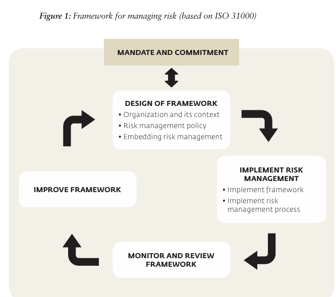
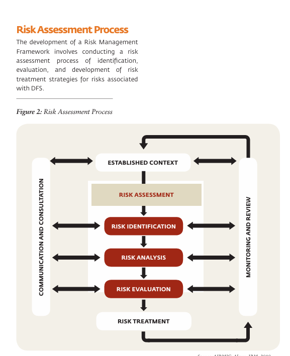

# Risk Management Overview

Risk is the "effect of uncertainty on objectives." It's a fundamental concept across industries, addressed through various definitions and frameworks, with ISO 31000 being a prominent global standard. This passage outlines key principles of a risk management framework, emphasizing commitment, framework design, implementation, ongoing monitoring, and continuous improvement.

## Risk Management Framework

**Risk Management Frameworks Overview:**

It emphasizes the critical role of risk management frameworks in addressing risks that businesses face. These risks can be anticipated or unexpected, and having a formal risk management framework is crucial for effective planning, understanding why things may not go as planned, and taking proactive actions to prevent losses. The ultimate goal is to be proactive rather than reactive when dealing with the inherent risks in a business model.

{width=50%}

**The Seven Rs and Four Ts of Risk Management Frameworks (As per ISO 31000):**

1. **Recognition of Risks:** This is the initial step, involving brainstorming and identifying all types and subtypes of risk events that could potentially occur and impact the implementation of Digital Financial Services (DFS). This step aims to create a comprehensive list of potential risks.

2. **Ranking or Evaluation of Risks:** After recognizing risks, they are assessed using qualitative criteria based on factors like probability and potential impact. Risks are then ranked from highest to lowest importance, allowing businesses to focus on the most critical ones.

3. **Responding to Significant Risks:** Based on the ranking, businesses develop risk management strategies:
   
     * *Tolerate:* Risks with low probability and low potential impact may be accepted or tolerated, as the cost of mitigating them could be higher than their potential impact.

     * *Treat:* Risks with moderate probability and potential impact are addressed with treatment measures to reduce potential losses.

     * *Transfer:* Risks with high probability and high potential impact can be transferred to third parties through methods like outsourcing or purchasing insurance.

     * *Terminate:* Risks with very high probability and potential impact can be terminated by discontinuing the DFS offering or seeking new partners or vendors.

4. **Resourcing Controls:** Businesses allocate budgets to implement risk responses effectively. This step ensures that financial resources are available to support risk management strategies.

5. **Reaction Planning:** Developing tactical responses to address specific risks effectively. This involves creating detailed plans to execute risk mitigation actions.

6. **Reporting and Monitoring Risk Performance:** Regular reporting on risk performance is essential. It helps determine whether a risk has occurred, if losses have taken place, if it has occurred but has been mitigated, or if it has not occurred yet. This reporting provides insight into the effectiveness of risk management efforts.

7. **Reviewing the Risk Management Framework:** Periodic reviews are crucial. The framework should be re-evaluated and adjusted as needed, especially when significant events occur or when there are changes in the business environment.

## Risk Assessment Process

Risk assessment is a systematic process used to identify, evaluate, and manage potential risks that could negatively impact an organization's assets, individuals, or operations. The goal is to reduce the likelihood and impact of adverse events. 

1. **Established Context**: This is the first step where the scope of the risk management process is determined. It involves understanding the environment in which the organization operates, including its objectives, stakeholders, and the specific circumstances under which the risks may occur.

2. **Risk Assessment**: This is an overarching process that encompasses the following steps. It aims to understand the nature of the risk and the harm it could cause.

3. **Risk Identification**: In this step, potential risks are systematically identified. It involves recognizing what, how, and why something might go wrong.

4. **Risk Analysis**: Once risks are identified, they are analyzed to determine their likelihood and potential consequences. This helps in understanding the extent of the risk.

5. **Risk Evaluation**: This step involves comparing the analyzed risk against risk criteria that the organization has established. The purpose is to determine the significance of the risk and whether it is acceptable or requires treatment.

6. **Risk Treatment**: This involves selecting and implementing measures to mitigate the risk to an acceptable level. Options may include avoiding the risk, reducing the risk through control measures, transferring the risk (e.g., through insurance), or accepting the risk.

7. **Communication and Consultation**: Throughout the process, it is important to communicate and consult with stakeholders to ensure that everyone understands the risks and the decisions taken to manage them.

8. **Monitoring and Review**: Risk assessment is not a one-time activity. The process is cyclical, with regular monitoring and review of risks and the effectiveness of risk treatment measures to ensure that no new risks have arisen and that the risk management measures remain appropriate.

## Risk Register

A risk register is a document used in risk management and project management to organize information about identified risks, their severity, and the actions steps to be taken. It is a key part of the risk management framework and acts as a central repository for all risks identified by an organization, allowing for the monitoring and reassessment of risks.

Contents of a risk register typically include:

- **Risk Category**: Classification of risks such as strategic, operational, financial, etc.
- **Risk Name**: The label given to each specific risk.
- **Description**: A detailed explanation of the risk and its potential impact.
- **Owner**: The individual responsible for managing the risk.
- **Cause**: The event that could trigger the risk.
- **Effect**: The potential outcome or impact of the risk occurring.
- **Risk Strategy**: The organization’s approach to managing the risk, which could be to tolerate, treat, transfer, or terminate it.
- **Risk Treatment Strategy**: Specific plans or actions to mitigate or manage the risk.
- **Treatment Tactical Response**: Procedures or policies in place as part of the risk treatment strategy.
- **Key Risk Indicator (KRI)**: Metrics that provide early warning signs of a risk.
- **Current Status**: The present state of the risk, including whether it has occurred and the effectiveness of any responses.