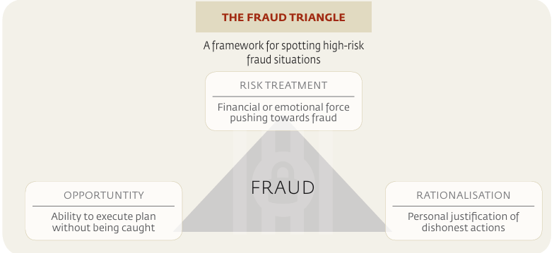

# The Fraud Triangle

Fraud Triangle, a framework for understanding the factors that may lead to committing fraud. It outlines three key elements: opportunity, pressure, and rationalization. These elements are often referred to as the three legs of the fraud triangle. The fraud triangle is a useful tool for understanding the factors that may lead to committing fraud. It outlines three key elements: opportunity, pressure, and rationalization. These elements are often referred to as the three legs of the fraud triangle.

- Opportunity: This element of the triangle suggests that individuals commit fraud because they can; they have the means to execute the plan without being detected.
- Pressure (Risk Treatment): Here, individuals feel a financial or emotional force that compels them toward fraudulent behavior, often due to financial stress or unattainable performance targets.
- Rationalization: This is the mental process where individuals justify their fraudulent actions to themselves, often by downplaying the seriousness or shifting the blame to justify their dishonest actions.

**Customer Fraud:**

- **Customers Defrauding Agents**:

  * Depositing counterfeit currency to exchange for electronic value or legitimate currency.
  * Unauthorized access of agents' POS devices to perform fraudulent transactions.
  * Unauthorized transactions via an agent’s web channel.
  * Creating and using fake vouchers to obtain cash or electronic value.

- **Customers Defrauding Customers**:
  * Gaining unauthorized access to other customers' PINs to conduct transactions.
  * Identity theft to access other customers’ accounts.
  * Phishing and SMS spoofing to deceive agents with seemingly legitimate messages.

**Agent Fraud:**

- **Agents Defrauding Customers**:

  * Unauthorized access to customers' PINs for fraudulent transactions.
  * Charging unauthorized fees and keeping them instead of remitting to the intended provider.
  * Conducting split withdrawals to earn higher commissions, thereby defrauding customers.