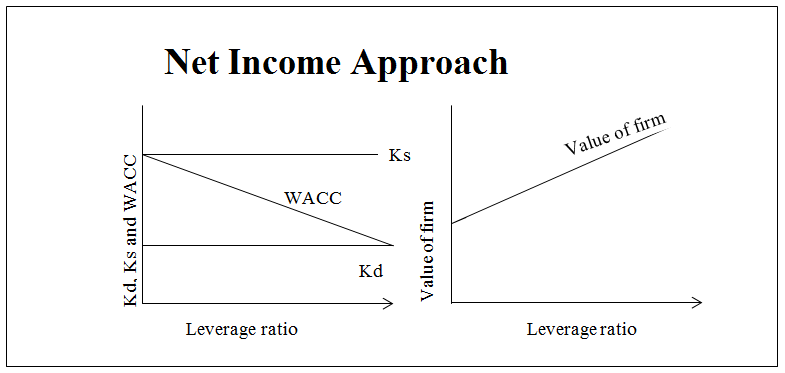
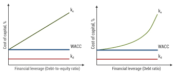
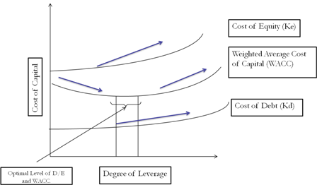

# Theories of Capital Structure

Capital structure is a critical aspect of financial management that deals with the mix of debt and equity used to finance a company's operations. Various theories have been proposed to explain the relationship between capital structure and the value of a firm. Here are four key theories of capital structure:

## 1. Net Income Approach

The Net Income Approach suggests that a company can enhance its value and lower its weighted average cost of capital (WACC) by increasing the proportion of debt in its capital structure. This approach is based on several assumptions:

- The cost of debt is lower than the cost of equity.
- There are no taxes.
- The use of debt does not change investors' perception of risk.

<!-- inline textblock 1 start -->
!!! info inline end "Abbreviations"
    Where:

    WACC is the weighted average cost of capital

    E is the market value of equity

    V is the total market value of the firm (E + D)

    Re is the cost of equity

    D is the market value of debt

    Rd is the cost of debt.

    Tc is the corporate tax rate.

**Formula:**
The formula for the weighted average cost of capital (WACC) in the Net Income Approach is:

WACC = (E/V) × Re + (D/V) × Rd × (1 - Tc)

According to this theory, as a firm increases its debt financing, it can take advantage of the tax deductibility of interest expenses, which lowers its overall cost of capital. This, in turn, increases the value of the firm.

## 2. Net Operating Income Approach

The Net Operating Income Approach, proposed by Durand, takes an opposing stance. It argues that changes in capital structure do not affect the market value of a firm, and the overall cost of capital remains constant, regardless of the financing method used. This approach assumes:

- The market values the entire firm.
- Business risk remains constant at every debt-equity mix.

In this theory, the use of debt increases the financial risk for equity shareholders, leading to higher equity costs. However, the cost of debt remains relatively constant, as lenders' financial risk is not significantly affected.

## 3. Traditional Approach

The Traditional Approach, also known as the Intermediate Approach, offers a compromise between the Net Income and Net Operating Income Approaches. It suggests that there exists an optimal capital structure achieved by balancing debt and equity. Key points include:

- Increasing debt initially lowers the overall cost of capital.
- Beyond a certain point, the cost of equity rises due to increased financial risk.
- There comes a stage where the increased cost of equity cannot be offset by low-cost debt.

The Traditional Approach implies that overall cost of capital decreases initially, remains relatively constant for moderate increases in debt, and eventually increases beyond a certain point.

## 4. Modigliani and Miller Approach

The Modigliani and Miller (M&M) Hypothesis is a seminal theory with two variations based on the presence or absence of corporate taxes.

**(a) In the Absence of Taxes:**
M&M argue that, in the absence of corporate taxes, the capital structure is irrelevant. Changes in capital structure do not affect the total value of a firm, as the increase in the cost of equity offsets the benefits of low-cost debt. The theory assumes perfect markets, rational investors, and identical risk characteristics of firms.

**Formula:**
In this case, the formula for the weighted average cost of capital (WACC) is the same as in the Net Income Approach:

WACC = (E/V) × Re + (D/V) × Rd

Where the terms are defined as previously mentioned.

**(b) When Corporate Taxes Exist:**
M&M recognized that with corporate taxes, the value of a firm increases, and the cost of capital decreases with increased debt usage due to the tax deductibility of interest expenses. In this case, an optimal capital structure is achieved by maximizing the debt mix.

**Formula:**
The formula for the WACC when corporate taxes exist is:

WACC = (E/V) × Re + (D/V) × Rd × (1 - Tc)

Where the terms are defined as previously mentioned, and Tc represents the corporate tax rate.

In summary, these theories provide different perspectives on how capital structure impacts a firm's value and cost of capital. The choice of the optimal capital structure depends on various factors, including the firm's risk tolerance, tax environment, and the availability of debt and equity financing.

