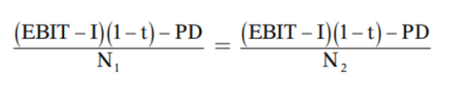
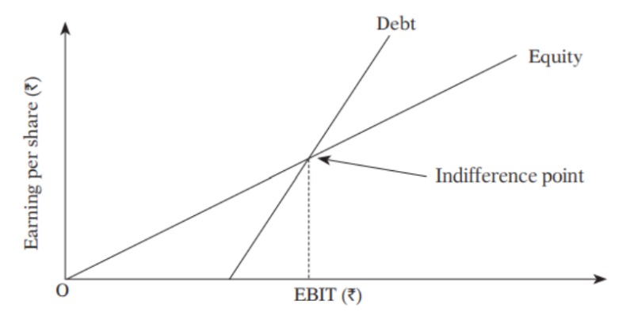

# Point of Indifference

The indifference point in financial analysis refers to the level of EBIT (Earnings Before Interest and Taxes) at which the earnings per share (EPS) under two different financial options are equal. It's a critical point where a company is indifferent between two financing or investment choices because they result in the same EPS. The two options typically involve different capital structures, such as different levels of debt or equity financing.

Here's how to interpret and make decisions based on the indifference point:

1. **If Expected EBIT < Indifference Point:**
    * In this scenario, the company's expected EBIT (operating profit) is lower than the indifference point.
    * It implies that the company is not generating enough earnings to cover its fixed financial costs (interest expenses) associated with either option.
    * Action: It's advisable to select the option that has a lower fixed financial burden because it reduces the risk of financial distress when EBIT is low.

2. **If Expected EBIT = Indifference Point:**
    * At this point, the expected EBIT is exactly equal to the indifference point.
    * It means that both financing options will result in the same EPS.
    * Action: The company can choose either option since the financial outcome (EPS) is the same under both.

3. **If Expected EBIT > Indifference Point:**
    * When the expected EBIT exceeds the indifference point, the company is generating sufficient earnings to cover its fixed financial costs for both options.
    * Action: In this case, it may be preferable to select the option with a higher fixed financial burden if it provides other advantages, such as tax benefits or strategic considerations.

The key idea behind the indifference point analysis is to determine the level of earnings at which the financial risk associated with different capital structures becomes inconsequential. It helps management make informed decisions regarding financing options, considering both the impact on EPS and financial risk.

Calculating the indifference point involves setting up and solving equations that equate the EPS under different financing scenarios. The result is the EBIT level at which the two options yield the same EPS, making the company indifferent to choosing either option.