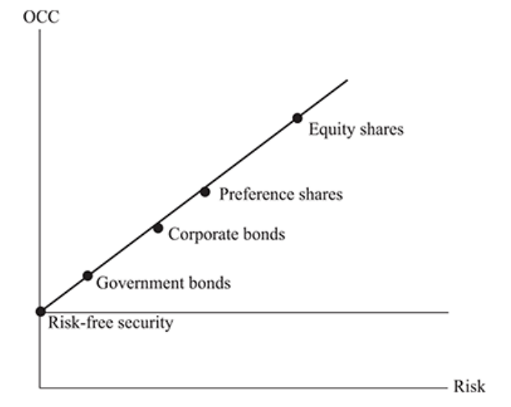

# Components of Cost of Capital by Funding Source

## **Debt Capital**
   - **Opportunity Cost of Debt Capital:** The cost of debt capital is the opportunity cost associated with using borrowed funds for a specific investment. It is the interest rate that must be paid to debt-holders.
   - **Creditors' Claims and Opportunities:** Debt-holders have a priority claim on a firm's assets and cash flows. They are exposed to the risk of default but expect periodic interest payments.

## **Preference Share Capital**
   - **Opportunity Cost of Preference Share Capital:** The cost of preference share capital represents the rate of return required by preference shareholders for investing in these shares. It is typically a fixed dividend rate.
   - **Creditors' Claims and Opportunities:** Preference shareholders have a claim on dividends before ordinary shareholders but after debt-holders. They are also subject to certain risks.

## **Equity Capital**
   - **Opportunity Cost of Equity Capital:** The cost of equity capital is the required rate of return demanded by ordinary shareholders. It reflects the risk and return expectations of these shareholders.
   - **Shareholders' Opportunities and Values:** Ordinary shareholders' required rate of return depends on their investment opportunities in the financial markets. They are the residual owners of the firm and bear the highest risk.

   

Since each source of funding has its risks and features that impact of cost of that respective capital, it is depicted in above image,by increasing order of risk and cost of capital.Where Equity capital has highest risk and cost of capital, followed by preference share capital and debt capital.

In summary, the cost of capital is determined by the opportunity cost associated with each source of funding, whether it's debt capital, preference share capital, or equity capital. The Weighted Average Cost of Capital (WACC) provides an overall benchmark for evaluating investment projects and making financial decisions, taking into account the risk and return expectations of various stakeholders.