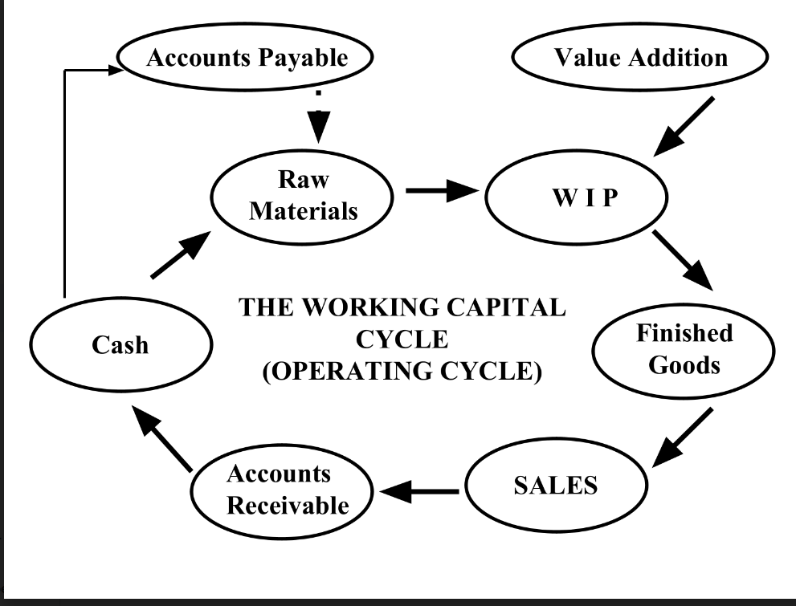

# Working Capital Cycle

The working capital cycle (WCC), also known as the operating cycle, is the length of time it takes to convert the total net working capital (current assets minus current liabilities) into cash. The cycle depicts the process through which a business turns its products into cash and includes the following stages:

1. **Cash**: The cycle starts with cash on hand which will be used to purchase raw materials.

2. **Accounts Payable**: This represents the money a company owes to its suppliers from whom it has purchased raw materials on credit. The management of accounts payable is crucial as it affects the company's cash flow.

3. **Raw Materials**: Purchased raw materials are the initial stage in the production process. Managing raw materials inventory efficiently ensures that the company has enough to meet production needs without tying up too much capital in inventory.

4. **Work In Progress (WIP)**: Raw materials are then converted into work-in-progress goods. These are goods that are in the process of being manufactured but are not yet complete. During this phase, value is added to the raw materials through labor and overhead costs.

5. **Finished Goods**: Once the goods are completed, they are moved to finished goods inventory, ready to be sold to customers. It's vital to manage this inventory effectively to meet sales demand without overproducing.

6. **Sales**: The finished goods are sold, either for cash or on credit terms. Sales on credit terms will create accounts receivable.

7. **Accounts Receivable**: This represents the money owed by customers to the company for goods sold on credit. Efficiently managing accounts receivable ensures that the company collects its cash as quickly as possible.

8. **Cash**: The cycle completes when the accounts receivable are collected and converted back into cash. This cash can then be used to pay off accounts payable, purchase more raw materials, or cover other business expenses.

The goal in managing the working capital cycle is to minimize the length of the cycle to improve the company's liquidity and operational efficiency. A shorter cycle means that the company can convert its working capital into cash faster, which is beneficial for meeting its short-term obligations and reducing its reliance on external financing.
The working capital cycle is the time taken to complete the above cycle. It is calculated as follows:

Working Capital Cycle = Inventory Days + Receivable Days - Payable Days

where,

- Inventory Days = (Average Inventory / Cost of Goods Sold) * 365
- Receivable Days = (Average Receivables / Sales) * 365
- Payable Days = (Average Payables / Cost of Goods Sold) * 365

