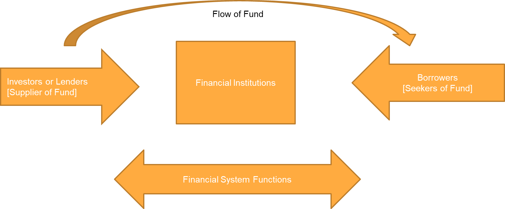

# Financial System: An Introduction

The financial system is a crucial component of any economy, serving as the backbone for various economic activities and transactions. It comprises institutions, markets, and intermediaries that facilitate the flow of funds and capital throughout the economy. The financial system plays a pivotal role in the allocation of resources, investment, savings, and economic growth.

## Key Elements of the Financial System

1. **Financial Institutions:** These are organizations that provide financial services to individuals, businesses, and governments. Key financial institutions include commercial banks, investment banks, credit unions, insurance companies, and pension funds.

2. **Financial Markets:** Financial markets are platforms where buyers and sellers come together to trade financial assets such as stocks, bonds, currencies, and commodities. Examples of financial markets include stock exchanges, bond markets, and foreign exchange markets.

3. **Financial Instruments:** Financial instruments are contracts or documents representing a financial asset. Common financial instruments include stocks, bonds, mortgages, derivatives, and certificates of deposit (CDs).

4. **Financial Intermediaries:** These institutions act as intermediaries between savers and borrowers, facilitating the transfer of funds from one party to another. Examples of financial intermediaries include banks, credit unions, and mutual funds.

5. **Regulatory Authorities:** Governments establish regulatory bodies to oversee and regulate the financial system. These authorities set rules and regulations to ensure the stability, fairness, and transparency of financial markets and institutions.

6. **Central Banks:** Central banks, such as the Federal Reserve in the United States, play a critical role in controlling the money supply, setting interest rates, and maintaining financial stability within a country.

## Significance of the Financial System

A well-functioning financial system is vital for economic development and stability. It enables individuals to save and invest, businesses to raise capital, and governments to finance public projects. A robust financial system fosters innovation, entrepreneurship, and wealth creation, contributing to overall prosperity.

In conclusion, the financial system acts as the circulatory system of an economy, facilitating the flow of funds, managing risks, and promoting economic growth. Understanding its components and functions is essential for individuals, businesses, and policymakers to make informed financial decisions and foster economic well-being.