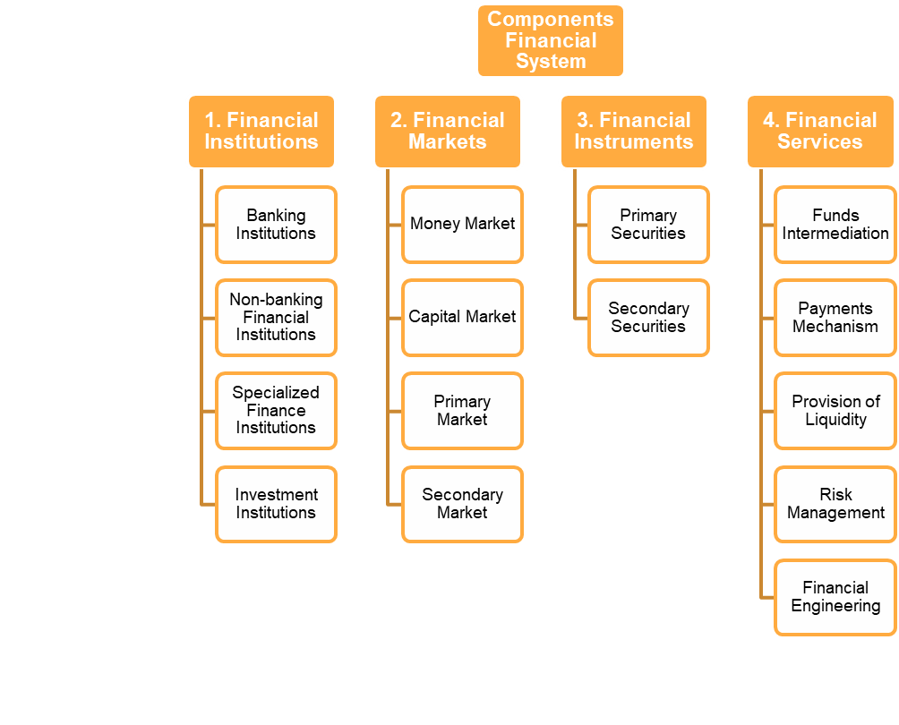

# Components of Financial System

## I. Financial Assets

In any financial system, understanding financial assets is fundamental. Financial assets are instruments that represent ownership or a claim to the economic resources of an individual, business, or government. These assets can be used for production, consumption, or further wealth creation. For example, when an individual purchases equity shares, those shares are considered financial assets because they have the potential to generate income in the future.

### Classification of Financial Assets

Financial assets can be categorized in different ways. One common classification includes:

#### (i) Marketable Assets

Marketable assets are those that can be easily transferred from one person to another without significant obstacles. Examples of marketable assets include shares of publicly listed companies, government securities, and bonds of public sector undertakings.

#### (ii) Non-Marketable Assets

Non-marketable assets, on the other hand, cannot be easily transferred. Examples of non-marketable assets include bank deposits, provident funds, pension funds, national savings certificates, and insurance policies.

#### Another Classification

Financial assets can also be classified into:

#### (i) Money or Cash Asset

Money assets encompass physical currency (coins and notes) issued by the government or central bank. Commercial banks can also create money through credit creation when they provide loans, thereby creating deposits.

#### (ii) Debt Asset

Debt assets are issued by various organizations to raise debt capital. Debt capital comes with a fixed repayment schedule for both interest and principal. Examples of debt assets include debentures, term loans, and working capital advances.

#### (iii) Stock Asset

Stock assets are issued by businesses to raise their fixed capital. There are two types of stock assets: equity and preference. Equity shareholders have ownership in the business and share in its profits and risks, while preference shareholders receive a fixed rate of dividend like debt asset holders but retain some characteristics of equity.

## II. Financial Intermediaries

Financial intermediaries are institutions that facilitate and intermediate financial transactions between individuals and corporate customers. They play a crucial role in the financial system by connecting those with excess funds (savers) to those in need of funds (borrowers). Financial intermediaries can be broadly categorized into two types:

### (i) Capital Market Intermediaries

Capital market intermediaries primarily provide long-term funding to individuals and corporate customers. They include term lending institutions like financial corporations and investment institutions like the Life Insurance Corporation (LIC).

### (ii) Money Market Intermediaries

Money market intermediaries supply short-term funds to individuals and corporate customers. Examples of money market intermediaries include commercial banks and cooperative banks.

## III. Financial Markets

Financial markets encompass the centers and arrangements that facilitate the buying and selling of financial assets, claims, and services. While financial transactions can occur anywhere, financial markets are critical in providing structure to these transactions. Financial markets can be categorized into:

### Organized Market

Organized markets have standardized rules and regulations governing financial transactions. They are subject to strict supervision and control by regulatory bodies. Organized markets can be further divided into:

#### - Capital Market

The capital market deals with financial assets with long or indefinite maturities, typically exceeding one year. It includes the industrial securities market (equity shares, preference shares, and debentures), government securities market, and long-term loans market.

##### - Industrial Securities Market

The industrial securities market facilitates the issuance of industrial securities such as equity shares, preference shares, and debentures. This market can be divided into the primary market (new issue market) and the secondary market (stock exchange).

- **Primary Market**: The primary market involves the issuance of new financial securities to the public for the first time. It plays a crucial role in capital formation and can involve methods like public issues, rights issues, and private placements.

- **Secondary Market**: The secondary market involves the secondary trading of securities that have already passed through the new issue market. It operates in stock exchanges and provides a continuous platform for buying and selling securities.

##### - Government Securities Market

The government securities market deals with the issuance and trading of government securities. It includes the government securities market and the state government securities market.

##### - Long-Term Loans Market

The long-term loans market deals with the issuance and trading of long-term loans. It includes the term loans market and the mortgage loans market.

#### - Money Market

The money market deals with financial assets with short maturities, typically less than one year. It includes the call money market, treasury bill market, commercial bill market, and certificate of deposit market.

##### - Call Money Market

The call money market deals with short-term funds that are lent and borrowed for a period of one day to 14 days. It is an inter-bank market where banks borrow and lend money to each other to meet their short-term fund requirements.

##### - Treasury Bill Market

The treasury bill market deals with short-term funds that are lent and borrowed for a period of 91 days to 364 days. It is an inter-bank market where banks borrow and lend money to each other to meet their short-term fund requirements.

##### - Commercial Bill Market

The commercial bill market deals with short-term funds that are lent and borrowed for a period of 91 days to 364 days. It is an inter-bank market where banks borrow and lend money to each other to meet their short-term fund requirements.

### Unorganized Market

Unorganized markets lack standardized rules and regulations and are not as strictly controlled by regulatory bodies. They often include moneylenders, indigenous bankers, traders, and private finance companies that lend money to the public. The RBI has taken steps to regulate some unorganized sector activities.

These concepts are foundational to understanding how the financial system operates, and they play a crucial role in the functioning of economies worldwide.
