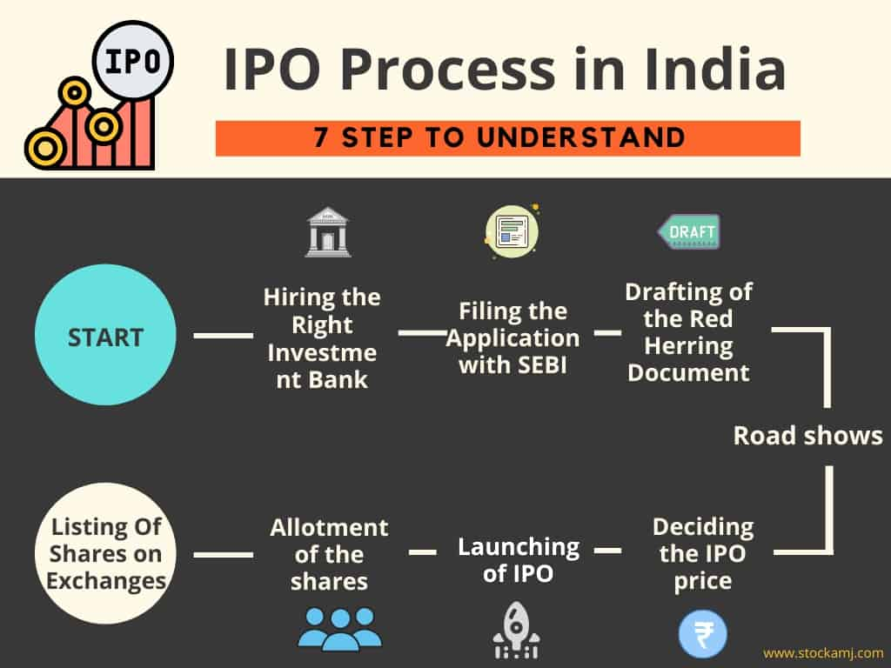

# Process of IPO

## Step 1: Hire an investment bank

A company seeks guidance from a team of underwriters or investment banks to start the process of IPO. More often than not, they take services from more than one bank. The team will study the company’s current financial situation, work with its assets and liabilities, and then they plan to cater to the financial needs. An underwriting agreement will be signed, which will have all the details of the deal, the amount that will be raised, and the securities that will be issued. Though the under-writers assure on the capital they will raise, they will not shoulder all the risks involved in the money movement.

## Step 2: Prepare RHP and register with the SEBI 

The Company and the underwriters, together, file the registration statement (mandatorily under the Companies Act) along with the Draft RHP (Red Herring Prospectus) which comprises of all the financial data, industry and business description, management details, probable price estimate per share, risk reports, business plans of the company and other disclosures as per the SEBI Act and Companies Act. It will have to declare how the Company is going to utilise the funds it will raise from the IPO and about the securities of public investment. These documents must be submitted to the local ROC (Registrar of Companies) at least 3 days before the offer is opened to the public for bidding. Then the company can make an application for the IPO to SEBI. The initial prospectus is called so because the first page of the prospectus contains a warning which states that this is not a final prospectus. However, all the obligations that the company’s prospectus will have, should also be contained in the RHP. Any variations between the two will have to be highlighted and be duly approved by SEBI and ROC.

If the registration statement is compliant with the stringent guidelines set by the SEBI, which ensures that the company has disclosed every detail a potential investor should know, then it gets a green signal. Or else it is sent back with comments. The company should then work on the comments and file for registration again. Only after the SEBI approves the application can the company set the date for the IPO. Thereafter, the financial prospectus is released. This phase also tests the waters for the IPO among the potential investors.

## Step 3: Application to Stock Exchange

The Company should decide on the stock exchange where it is going to list its shares and apply there.

## Step 4: Go on a roadshow

Before the IPO goes public, this phase happens over an action-packed two weeks. The executives of the Company travel around the country marketing the upcoming IPO to potential investors, mostly QIBs in important financial centres. The agenda of the marketing includes the presentation of facts and figures, which will drum up the most positive interest.  At this stage of the IPO, the company may also give an opportunity to the bigger organisations to buy stocks of the company at a price set before the stock goes public.

## Step 5: IPO is priced

Based on whether the Company wants to float a Fixed Price IPO or Book Building Issue, the price or price band is fixed.

- Fixed price method – The underwriter and company work together to fix a price for their shares. The account of the liabilities, the target capital to be achieved, and the demands of stocks and every other related detail to come up with a price.

- Book building method – Here the underwriter and the company fix a price band within which the investors can bid. The final price is dependent on the demand for the shares, the biddings received and the target capital to be achieved. Except for infrastructure companies and banks, most companies are free to set their share price band. The Company is allowed to set the cap price at 20% higher than the floor price. Books are normally open for 3 days during which bidders can revise their bids. Issuers often prefer book-building as it allows better price discovery. The final price of the issue is called the Cut-off Price.

The Company should also decide on the stock exchange where it is going to list its shares and apply there.

## Step 6: Available to the public 

On a planned date, the application forms are made available to the public who can get a form from any designated bank or broker firms. Once they fill in the details, they can submit them with a cheque, or online, as well. SEBI has fixed the period of availability of an IPO to the public, which is usually 5 working days.

When should the IPO reach the public – is a tricky decision. Because picking the right time to offer shares is very imperative to maximise the earnings of sale. Some companies have their own economic timeline to go public. If the giant companies are scheduled to come into the market, smaller companies avoid their entry going public at the same time, fearing the stealing of the limelight by the giant companies.

Once the IPO bidding is closed, the company has to submit the final prospectus to both ROC and SEBI. This should contain both the quantum of shares being allotted and the final issue price on which the sale is closed.

## Step 7: Going through with the IPO

After the IPO price is finalised, the stakeholders and under-writers work together to decide how many shares each investor will receive. Investors will usually get full securities unless they are oversubscribed. The shares are credited to their demat account. The refund is given if the shares are oversubscribed. Once the securities are allotted, the stock market will start trading the Company’s IPO.

Businesses must also ensure that its internal investors do not trade and thereby manipulate the stock prices of the IPO. 

IPO shares are allotted to the bidders within 10 days of the last date of bidding.

If the IPO is oversubscribed, the shares are allotted proportionately to the applicants. For example, if the oversubscription is five times the allotted number of shares. Then an application for 10 lakh shares will be allotted only 2 lakh shares.

