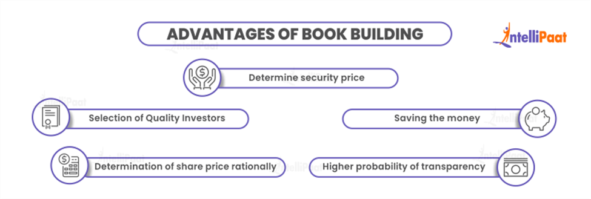

# Book Building

According to SEBI regulations, **book building** is essentially a method used in **Initial Public Offering (IPO)** to obtain an effective price. An IPO is opened for a specific time period, and then bids are gathered from investors at a range of values that fall within the price range set by the issuer.

This process is directed forward to both institutional investors as well as retail investors. The issue price is determined when demand is generated in the process. In simple terms, book building is a process used by companies raising capital through IPO to use it for price and demand discovery.

Book building is a capital-distribution method used primarily for promoting an equity share offering to the general public by aiming at both wholesale and retail investors. Following the bid closing date, the issue price is chosen based on a set of evaluation criteria.

In India, book building is done using a method where the issuer establishes a base price and a price band that is roughly equivalent to the filing range used in the US. This is the main reason why this term is getting popular and used more frequently in the Investment banking sector.

## Types of Book Building

There are also two different sorts of book-building processes: **75% book building** and **100% book building**. Let us check the basic difference between the two so that we can have a better understanding of how the two types differ fundamentally:

- **75% Book Building**: In accordance with this procedure, 25% of the issue must be sold at a fixed price, and the remaining 75% must be offered through the Book Building procedure.

- **100% Book Building**: In this type, either 100% of the total profits from the book-building process are offered to the public or 75% of the net offer to the public is made through the Book Building process, and 25% of the net offer made to the public at the amount decided through the Book Building process.

Both types play a fundamental role in the banking sector as both types provide versatile features that can be used to decide the price of an IPO. However, it is a common practice in most developed countries like the USA, UK, France, Germany, Japan, China, and many others.

## Advantages of Book Building

- Book building can help to determine a security’s price and the intrinsic worth of its shares.
- When we issue the company we can get the benefit of selecting quality investors.
- The book building process results in saving money as we know funds that are being spent on marketing and advertising activities are saved after using the book-building process.
- Share price can be determined rationally by looking at the demand for the same in the market.
- Book building process informs the general public about the bidding information due to which there is a higher probability of transparency.

## Characteristics of Book Building Process

In the above section, we have seen what exactly Book Building means. Now let us see the most significant characteristics of the Book Building process:

- The number of securities to be offered, as well as the price range for the bids, is specified by the Issuer.
- The book is generally available for a period of five days.
- Bids must be submitted within the price range that has been indicated.
- Bidders have the option to amend their bids before the book closes.
- The book runners analyze bids on the basis of demand at different price levels once the book-building period has come to an end.
- The issuer who intends to make an offer appoints one or more lead merchant bankers to act as ‘book runners’.
