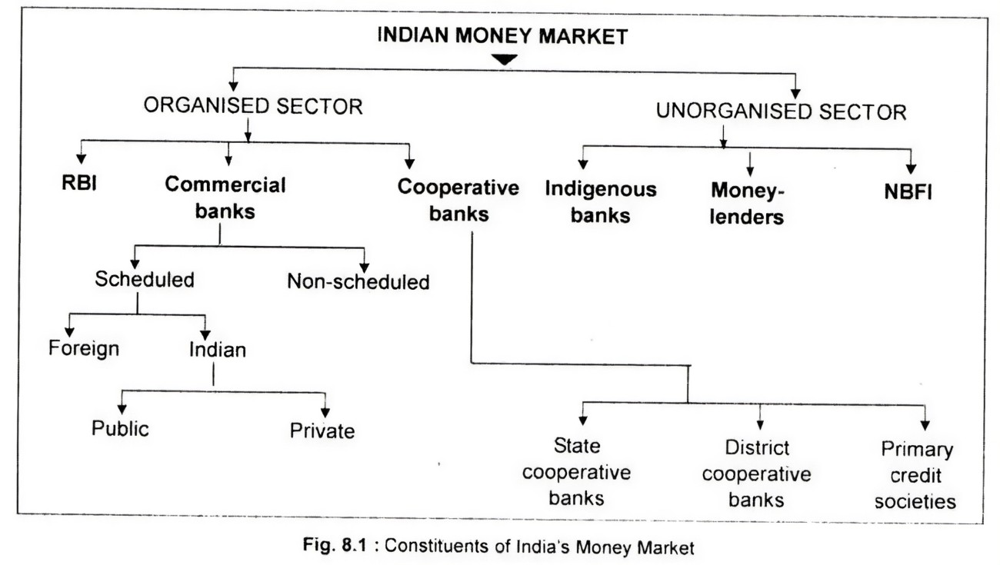

# Structure of the Indian Money Market

The Indian money market is a complex financial system composed of both organized and unorganized sectors. These sectors serve various purposes and cater to different segments of the economy. Here's an overview of the structure of the Indian money market:

## Organized or Modern Sector

The organized sector of the Indian money market includes regulated and well-established financial institutions. These institutions are subject to oversight and control by regulatory authorities like the Reserve Bank of India (RBI). Key participants in the organized sector include:

- Reserve Bank of India (RBI): As India's central bank, the RBI plays a pivotal role in the money market. It regulates and supervises various aspects of the market, including monetary policy, interest rates, and financial stability.

- Commercial Banks: Commercial banks are the backbone of the organized money market. They include both private and public sector banks. These banks provide a wide range of financial services, including loans, deposits, and investment opportunities.

    * Scheduled Commercial Banks: Scheduled commercial banks are banks that are listed in the Second Schedule of the Reserve Bank of India Act, 1934. They are subject to RBI regulations and oversight. Scheduled commercial banks include both public and private sector banks.

    * Non-Scheduled Commercial Banks: Non-scheduled commercial banks are banks that are not listed in the Second Schedule of the Reserve Bank of India Act, 1934. They are not subject to RBI regulations and oversight. Non-scheduled commercial banks include both public and private sector banks.

- Cooperative Banks: Cooperative banks operate at the grassroots level, serving specific regions and communities. They offer banking services similar to commercial banks but with a focus on local needs.
    * Primary Credit Societies (PCS): PCS are cooperative banks that provide financial services to individuals and small businesses in rural areas. They are often the only source of banking services in remote regions.

    * State Cooperative Banks (SCBs): SCBs are cooperative banks that operate at the state level. They provide banking services to individuals and businesses in their respective states.

    * District Central Cooperative Banks (DCCBs): DCCBs are cooperative banks that operate at the district level. They provide banking services to individuals and businesses in their respective districts.

## Unorganized or Traditional Sector

- Indigenous Bankers: Indigenous bankers are individuals or firms that provide banking services to local communities. They are often the only source of banking services in remote areas. Indigenous bankers are not subject to RBI regulations and oversight.

- Money Lenders: Money lenders are individuals or firms that provide loans to individuals and businesses. They are not subject to RBI regulations and oversight.

- NBFI : Non-Banking Financial Institutions (NBFIs) are financial institutions that provide banking services without being licensed as banks. They are not subject to RBI regulations and oversight.

In Conclusion, the Indian money market is a complex financial system composed of both organized and unorganized sectors. These sectors serve various purposes and cater to different segments of the economy. Understanding the structure of the Indian money market is essential for making informed financial decisions and fostering economic growth.
 

