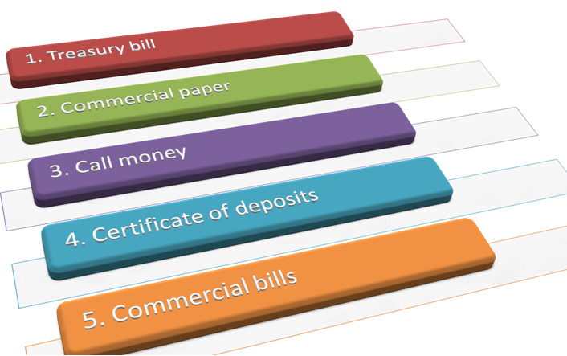

# Money Market Instruments

## **Treasury Bills (T-bills)**:
   - Short-term government securities with a maturity of less than a year.
   - Issued by the Central Government through the Reserve Bank of India (RBI).
   - Highly liquid and low-risk instruments.
   - Sold at a discount to face value and redeemed at face value upon maturity.
   - The difference between the purchase price and face value represents the interest earned.
   
## **Commercial Paper**:
   - Short-term unsecured promissory notes issued by creditworthy corporations.
   - Typically matures between 15 days and one year.
   - Provides a cost-effective way for corporations to raise short-term funds.
   - Sold at a discount and redeemed at face value.
   - Often used for working capital needs and bridge financing.

## **Call Money**:
   - Short-term finance with a maturity ranging from one day to fifteen days.
   - Used for inter-bank transactions.
   - Helps banks maintain the cash reserve ratio (CRR) set by the RBI.
   - Call rates are highly volatile and have an inverse relationship with other short-term money market rates.

## **Certificate of Deposit (CD)**:
   - Unsecured, negotiable, short-term instruments issued by commercial banks and financial institutions.
   - Mobilizes large sums of money for short periods.
   - Provides an avenue for individuals, corporations, and businesses to invest in short-term instruments.
   
## **Commercial Bill**:
   - A bill of exchange used to finance working capital needs of companies.
   - Used to fund credit sales by firms.
   - Buyer becomes obligated to make payment on a future date when goods are sold on credit.
   - Seller can wait until the specified date or use a bill of exchange.
   - Bills can be discounted with a bank if funds are needed before maturity.
   - When accepted by a commercial bank, it becomes a marketable instrument known as a trade bill.

These money market instruments play essential roles in facilitating short-term financing, managing liquidity, and providing investment options to various participants in the financial market. They contribute to the overall efficiency and stability of the financial system by offering a range of choices to meet different financial needs and risk appetites.