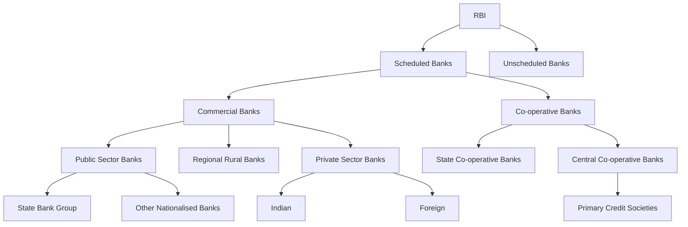

# Banking

Banking is a fundamental component of the economic framework of any country, deeply intertwined with both the trade sector and the personal finances of individuals. It encompasses an industry that deals with credit, cash, and a variety of financial transactions.

## What is Banking?

- **Industry Managing Financial Transactions**: Banking involves managing financial transactions like credit and cash.
- **Influential in Economy**: The commercial bank is a key institution, significantly influencing a country's economy and providing credit to customers.
- **Transaction Handling**: In India, a banking company handles various transactions, including cheque withdrawals, payments, investments, etc.
- **Deposit and Loan Services**: Banks are involved in accepting deposits and lending money, with the aim of earning profits through these activities.

## Structure of Banking in India

**Scheduled Banks**: These are banks included in the Second Schedule of the RBI Act, 1934, and maintain a certain reserve with the RBI, allowing them to access RBI facilities and borrowings.

**Non-Scheduled Banks**: These banks are not listed in the Second Schedule and typically have a reserve capital of less than 5 lakh rupees. They don't have borrowing privileges from the RBI like Scheduled Banks do. There are a few such banks in India, operating in specific local areas.

## Types of Banking

1. **Commercial Banks**:
    * **Regulated by Law**: Governed by the Banking Regulation Act, 1949.
    * **Public Deposits and Lending**: Accept deposits from the public for lending or investment purposes.

2. **Cooperative Banks**:
    * **Governed by Cooperative Societies Act**: Operate under the State Cooperative Societies Act.
    * **Focus on Affordable Credit**: Provide affordable credit, primarily serving the rural population.

3. **Specialized Banks**:
    * **Target Specific Needs**: Cater to specific industries or sectors like foreign trade.
    * **Examples**: Include foreign exchange banks, export-import banks, development banks, etc.

4. **Central Banks**:
    * **Regulatory Role**: Responsible for managing, monitoring, and regulating the activities of commercial banks in a country.
    * **Monetary Authority**: Acts as the chief monetary authority, overseeing monetary policy and currency issuance.

In essence, the banking sector serves as the backbone of the financial system in any economy. It not only facilitates the flow of money and credit but also plays a critical role in overall economic development and stability. Commercial banks, cooperative banks, specialized banks, and central banks each fulfill distinct roles, catering to different needs within the economy.