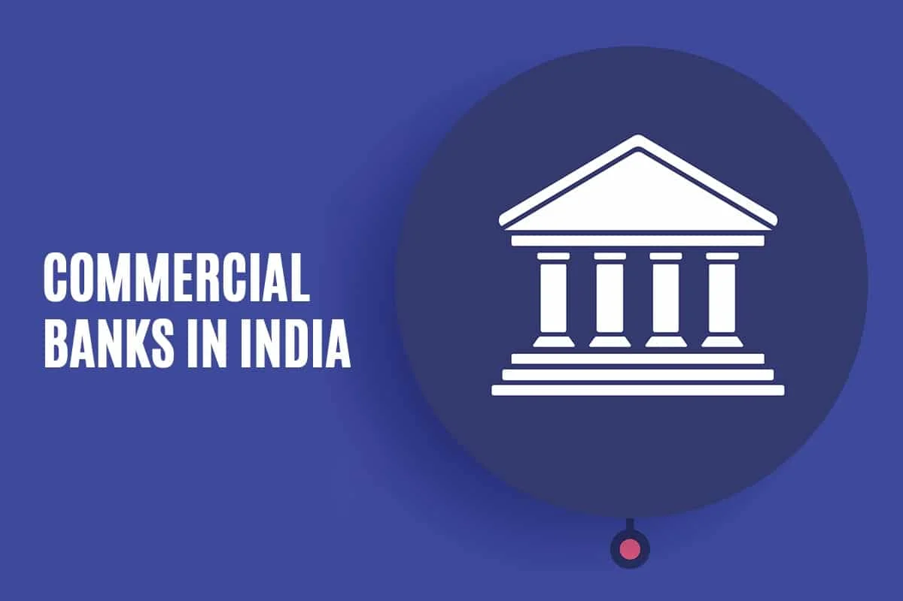
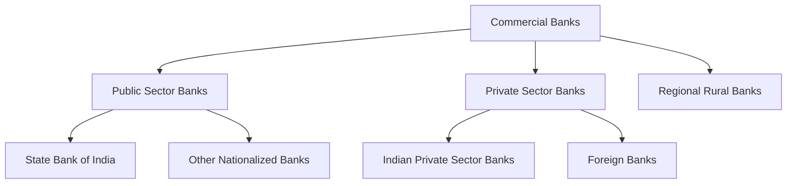

# Commercial Banks
Commercial banks are financial institutions that operate with the primary aim of earning profit. They offer a wide range of banking services to the general public, businesses, and other organizations. These banks are regulated by national banking laws and overseen by financial authorities like the central bank in their respective countries.

Commercial banks are also known as business banks or corporate banks. They are different from investment banks, which primarily deal with raising capital for businesses and governments. Commercial banks are also distinct from central banks, which are responsible for regulating the money supply in the economy.

## Types of Commercial Banks

Commercial banks can be classified into various types based on their ownership, functions, and operations. The following are some of the most common types of commercial banks:

### Public Sector Banks 

Public sector banks are banks where the majority of the shares are held by the government. These banks are also known as nationalized banks. In India, the government nationalized 14 banks in 1969 and 6 more in 1980. The following are some of the major public sector banks in India:

#### State Bank of India 

State Bank of India (SBI) is the largest public sector bank in India. It was established in 1955 and is headquartered in Mumbai. SBI has over 24,000 branches and 59,000 ATMs across the country. It also has a presence in 36 countries worldwide. SBI offers a wide range of banking services, including savings accounts, current accounts, fixed deposits, loans, and credit cards.

#### Other Nationalized Banks

Other nationalized banks in India include:

- Bank of Baroda

- Bank of India

- Canara Bank

- Central Bank of India

These banks offer similar services to SBI and have a wide network of branches and ATMs across the country.The government has also merged some of these banks to form larger entities. For example, Bank of Baroda, Vijaya Bank, and Dena Bank were merged in 2019 to form the second-largest public sector bank in India.

### Private Sector Banks

Private sector banks are banks where the majority of the shares are held by private individuals or entities. These banks are also known as scheduled banks. In India, private sector banks are regulated by the Reserve Bank of India (RBI) under the Banking Regulation Act, 1949. The following are some of the major private sector banks in India:

#### Indian Private Sector Banks

Indian private sector banks are banks that are incorporated in India and have their headquarters in the country. The following are some of the major Indian private sector banks in India:

- Axis Bank

- ICICI Bank

- HDFC Bank

- Kotak Mahindra Bank

These banks offer a wide range of banking services, including savings accounts, current accounts, fixed deposits, loans, and credit cards. They also have a wide network of branches and ATMs across the country.

#### Foreign Banks

Foreign banks are banks that are incorporated outside India and have their headquarters in a foreign country. These banks are also known as foreign banks. In India, foreign banks are regulated by the Reserve Bank of India (RBI) under the Banking Regulation Act, 1949. The following are some of the major foreign banks in India:

- Citibank

- HSBC

- Standard Chartered Bank

- Deutsche Bank

These banks offer a wide range of banking services, including savings accounts, current accounts, fixed deposits, loans, and credit cards. They also have a wide network of branches and ATMs across the country.

### Regional Rural Banks

Regional Rural Banks (RRBs) in India represent a unique institution in the banking sector, specifically designed to cater to the financial needs of the rural population. Established on October 2, 1975, following the recommendations of the M. Narasimham Working Group during the tenure of Prime Minister Indira Gandhi, these banks have played a significant role in promoting financial inclusion in rural areas. The following are some of the major regional rural banks in India:

- Andhra Pradesh Grameena Vikas Bank

- Andhra Pragathi Grameena Bank

- Arunachal Pradesh Rural Bank

- Assam Gramin Vikash Bank

These banks offer a wide range of banking services, including savings accounts, current accounts, fixed deposits, loans, and credit cards. They also have a wide network of branches and ATMs across the country.It is important to note that RRBs are not commercial banks in the strict sense of the term. They are not incorporated under the Companies Act, 1956, and are not governed by the Banking Regulation Act, 1949. Instead, they are registered under the Regional Rural Banks Act, 1976, and are regulated by the National Bank for Agriculture and Rural Development (NABARD).

## Functions of Commercial Banks

1. **Acceptance of Deposits**: Commercial banks accept deposits from the public, which forms the basis of their lending capacity. These deposits can be in various forms, such as savings accounts, current accounts, fixed deposits, etc. Banks pay interest on these deposits, with rates often determined by regulatory authorities like the Reserve Bank of India (RBI).

2. **Lending of Funds**: One of the primary functions of commercial banks is to provide loans and advances to individuals, businesses, and other entities. This lending can take various forms, including overdrafts, cash credits, and term loans. The interest charged on these loans forms a significant part of a bank's revenue.

3. **Cheque Facilities**: Banks offer cheque facilities to their account holders, allowing them to make payments and withdrawals without needing hard cash. Cheques can be of different types, such as bearer cheques, which are cashable immediately, and crossed cheques, which need to be credited to the payee's account. This system is an integral part of the credit mechanism in the economy.

4. **Remittance of Funds**: Commercial banks also facilitate the transfer of money. They provide services like issuing drafts, pay orders, and enabling electronic transfers through systems like NEFT (National Electronic Funds Transfer) and RTGS (Real-Time Gross Settlement). These services are typically provided for a nominal fee and are essential for both personal and business financial transactions.

Overall, commercial banks are fundamental to the functioning of a modern economy, providing necessary financial services that enable both savings and investments, facilitating daily transactions, and contributing to the overall financial stability and growth of a country.