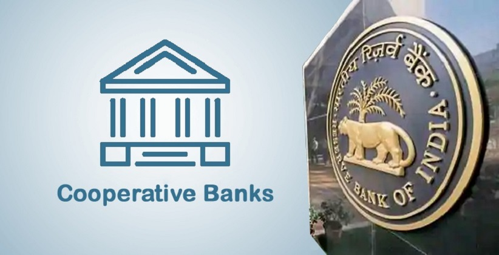

# Co-operative Banks

Cooperative Banks in India encompass a range of financial institutions that operate within the cooperative sector, each serving specific financial needs of their members and communities. They are significant players in the Indian banking landscape, especially in rural and semi-urban areas.

## Types of Cooperative Banks

1. **State Co-Operative Banks**: These are small financial institutions governed by the Banking Regulations Act, 1949, and Banking Laws Cooperative Societies Act, 1965. There are about 33 State Co-Operative Banks in India, of which 19 are scheduled.

2. **Primary Credit Societies**: Also known as Primary Agricultural Credit Society (PACS), these are the smallest co-operative credit institutions operating at the grassroots level. They function like banks but are smaller in scale and not part of the payment system.

3. **Urban/Central Co-Operative Banks**: Located in urban and semi-urban areas, these banks were initially focused on non-agricultural lending but have since diversified. They traditionally cater to small borrowers and businesses.

## Features of Cooperative Banks

- **Customer-Owned Entities**: Members of cooperative banks are both the customers and the owners.
- **Democratic Member Control**: They are democratically controlled by members who elect a board of directors. Voting rights are usually equal for all members.
- **Profit Allocation**: Profits are allocated to reserves, and a portion may be distributed to members within legal and statutory limits.
- **Financial Inclusion**: These banks play a significant role in including unbanked rural populations in the financial system.

## Advantages of Cooperative Banking

- **Alternative to Traditional Credit**: They provide a more effective and affordable alternative to village money lenders.
- **Cheap Credit**: Cooperative Banks offer credit at lower rates, especially beneficial for rural areas.
- **Productive Borrowing Culture**: They discourage unproductive borrowing and promote savings and investment.
- **Agricultural Development**: They support better agricultural practices by providing credit for improved seeds, fertilizers, and modern implements.
- **Higher Interest Rates on Deposits**: Often, they offer higher interest rates on deposits compared to traditional banks.

## Problems with Cooperative Banking in India

- **Financial Weakness**: Many primary credit societies are financially weak and struggle to meet credit needs.
- **Increasing Overdues**: Loan repayment delays are a growing issue, affecting the recycling of funds.
- **Resource Constraints**: Limited owned funds make raising working capital challenging.
- **Regional Disparities**: There is significant variation in the development of cooperatives across different states.
- **Political Interference**: Political influence often affects the governance and effectiveness of these institutions.
- **Competition and Technological Challenges**: They face stiff competition from commercial banks and newer financial institutions like small-finance banks.

## Dual Regulation of Urban Cooperative Banks

- **Regulated by RCS and RBI**: Urban Cooperative Banks are regulated by State Registrars of Co-operative Societies (RCS) for single-State banks and Central Registrar of Co-operative Societies (CRCS) for multi-State banks. The RBI oversees banking-related functions like licensing, interest rates, loan policies, etc.

Cooperative banks in India serve a critical role in providing financial services, especially in rural and semi-urban areas. They are characterized by their member-centric approach, democratic governance, and focus on financial inclusion. However, they also face challenges related to financial strength, political interference, and adapting to modern banking practices.