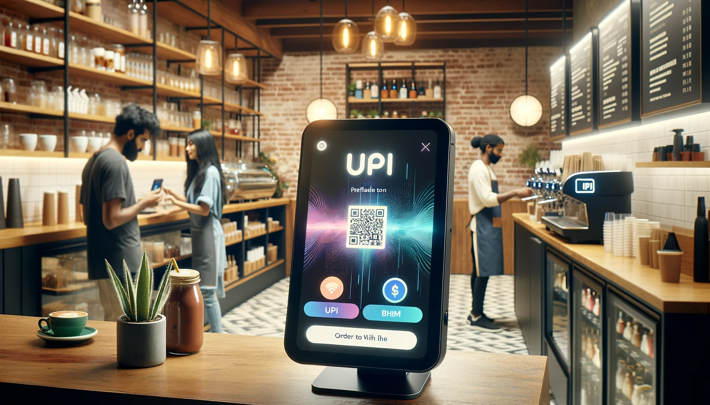

# Modern Channels in Banking Services: UPI and BHIM

The financial landscape has experienced significant transformations in the past decade, primarily due to technological advancements. Modern channels have been introduced to enhance the ease and efficiency of banking services. Among these, UPI (Unified Payments Interface) and BHIM (Bharat Interface for Money) have emerged as prominent game-changers in India.

## UPI (Unified Payments Interface)

UPI is an innovative real-time payment system developed by the National Payments Corporation of India (NPCI) that facilitates inter-bank transactions by instantly transferring funds between two bank accounts on a mobile platform. 

### Features of UPI:

1. **Real-time Transfers**: UPI allows instant money transfer round the clock.
2. **Single Mobile Application**: It permits access to multiple bank accounts in a single mobile application.
3. **Virtual Payment Address (VPA)**: Instead of sharing bank details, users can create a VPA, a unique ID ensuring privacy.
4. **QR Code**: Users can make payments by scanning QR codes without entering additional bank details.
5. **Schedule Payments**: UPI also facilitates scheduling of payments for future dates.

### Benefits:

1. **Seamless and Fast**: Eliminates the need for entering NFSC code or lengthy bank account numbers.
2. **Secure**: Encrypted transactions and the use of MPIN (Mobile Personal Identification Number) ensure security.
3. **Interoperable**: It works across all banks and financial institutions participating in the UPI ecosystem.

## BHIM (Bharat Interface for Money)

BHIM, launched by the NPCI, is a mobile app that leverages the UPI platform, aiming to simplify and promote digital payments in India. It's named in honor of Dr. Bhimrao Ambedkar.

### Features of BHIM:

1. **Direct Bank Transfers**: Users can send or receive money directly from their bank accounts using BHIM.
2. **Check Balance**: Users can check their bank account balance and transaction history.
3. **QR Code**: Facilitates QR-based scans for easy payments.
4. **Multilingual**: Supports multiple languages catering to a diverse population.
5. **Transaction Limits**: BHIM allows up to ₹40,000 per transaction and ₹40,000 per day for one bank account.

### Benefits:

1. **Unified Platform**: Consolidates multiple bank functions into a single platform.
2. **Easy Accessibility**: Simplified for the general public, ensuring ease of use.
3. **Low-cost Infrastructure**: No requirement for POS (Point of Sale) machines. A simple smartphone suffices.
4. **Wider Acceptance**: Since it's supported by a large number of banks in India, its acceptance is wide-ranging.

## Conclusion

The introduction of UPI and BHIM signifies the shift towards a more integrated and digital banking system in India. These platforms not only make financial transactions seamless and instantaneous but also pave the way for a less-cash economy, promoting transparency and financial inclusivity. As technology continues to evolve, it's expected that more such innovative solutions will emerge, further revolutionizing the banking and financial sectors.