# Insurance

Insurance is a financial arrangement that provides protection against financial loss or risk. It's a contract, represented by a policy, in which an individual or entity receives financial protection or reimbursement against losses from an insurance company.

> According to D.S. Hansell, "Insurance is a social device providing financial compensation for the effects of misfortune, the payments being made from the accumulated contributions of all parties participating in the scheme."

## Principles:
Insurance operates on several fundamental principles:

1. **Principle of Indemnity:**  It states that insurance is a mechanism to provide compensation for the loss, and not to make a profit from the event.
   
2. **Principle of Insurable Interest:** The insured must have a financial interest in the subject matter of insurance.
   
3. **Principle of Utmost Good Faith:**  Both the insured and the insurer are required to disclose all material facts honestly.
   
4. **Principle of Subrogation:**   After a loss is paid, the insurer steps into the shoes of the insured to recover the amount of loss from the third party responsible for the loss.
   
5. **Principle of Contribution:**   If more than one insurance policy covers the risk, each insurer contributes to the loss in proportion to the sum insured.
   
6. **Principle of Proximate Cause:**   The cause of loss must be covered under the insurance policy, and the loss must be proximately caused by the insured peril.

7. **Principle of Loss Minimization:**   The insured must take all reasonable steps to minimize the loss.

## Classification:
Insurance can be classified into various categories based on different criteria:

1. **Based on the Nature of Risk:**
       *  **Life Insurance:** Covers the risk of death.
       *  **Non    * life Insurance:** Covers various other risks like accident, fire, health, etc.

2. **Based on the Subject Matter:**
       *  **Personal Insurance:** Provides compensation for life, health, unemployment, etc.
       *  **Property Insurance:** Insures property like buildings, machinery, etc.
       *  **Liability Insurance:** Provides coverage for legal liabilities.
       *  **Fidelity Insurance:** Covers the risk of dishonesty, fraud, etc.

3. **Based on Duration:**
       *  **Term Insurance:** Provides coverage for a specified term.
       *  **Whole Life Insurance:** Provides coverage for the whole life of the insured.

4. **Based on the Number of Persons Insured:**
       *  **Individual Insurance:** Provides coverage to an individual.
       *  **Group Insurance:** Provides coverage to a group of individuals.

5. **Based on Business Model:**
       *  **Private Insurance:** Managed by private entities.
       *  **Public Insurance:** Managed by government entities.

6. **Based on Payment Terms:**
       *  **Single Premium Insurance:** A lump sum amount is paid as premium.
       *  **Regular Premium Insurance:** Premium is paid at regular intervals.

The classification and principles of insurance provide a framework that helps in understanding the various facets and dimensions of insurance. Through insurance, individuals and entities can manage the risks to which they are exposed in their personal and professional lives, ensuring financial stability and peace of mind.