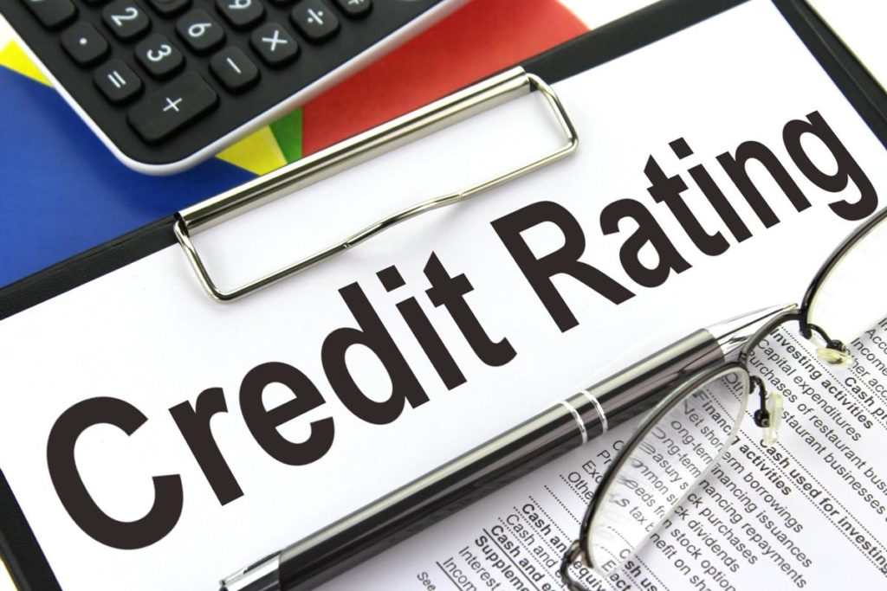

# Credit Rating

Credit rating is a service that assesses the creditworthiness of a borrower, which can be an individual, corporation, government, or a country. It indicates the likelihood of the debtor meeting their financial obligations, including interest and principal repayments. Credit Rating Agencies specialize in evaluating the financial strength of entities.

V

## Why is a Credit Rating Important?

### Access to Credit
- **For Individuals and Businesses**: A good credit rating is crucial for accessing loans and credit facilities.
- **For Lenders**: It's a tool to assess the risk associated with lending money.

### Financial Opportunities
- **Lower Interest Rates**: Higher credit ratings often qualify for lower interest rates on loans.
- **Access to Financial Products**: A positive credit rating enables access to products like mortgages, car loans, and credit cards.

### Business Expansion
- **Funding**: Essential for businesses to obtain financing for expansion or investment.
- **Trade Credit Terms**: Influences the terms of trade credit with suppliers.

### Investor Confidence and Cost of Capital
- **Investor Trust**: A measure of confidence for investors.
- **Lower Capital Cost**: Companies with higher ratings can raise capital more cheaply.

## Types of Credit Ratings

### Bond / Debenture Rating
- Evaluates the quality of bonds and debentures, affecting their appeal to investors.

### Structured Obligation
- Assigned to financial products, not the issuing organization, with an added suffix (SO).

### Equity Ratings
- Assesses stock performance and risk, influencing investment decisions.

### Sovereign Rating
- Reflects a country's ability to repay debts, impacting its borrowing costs.

## Rating Methodology

The process involves a thorough analysis of factors affecting the issuer's creditworthiness. It assesses future cash generation capability and its sufficiency for debt obligations, including a SWOT analysis.

## Major Credit Rating Agencies in India

### CRISIL (Credit Rating and Information Services of India Ltd.)
- Largest in India, established in 1987.
- Majority stake held by Standard & Poor.
- Provides ratings on the likelihood of timely interest and principal payments.

### ICRA (Investment Information and Credit Rating Agency)
- Operational since 1991, with Moody's as the largest shareholder.
- Specialized team for the MSME sector.
- Promoted by IFCI, ratings depend on the borrower's nature.

### CARE (Credit Analysis and Research Limited)
- Founded in April 1993.
- Major promoters include IJTI, IDBI, and Canara Bank.
- Covers ratings for various debt instruments.

### Acuite Ratings & Research Ltd (Formerly SMERA Ratings Ltd.)
- Focuses primarily on the Indian MSME segment.
- Aims for comprehensive, transparent, and reliable ratings.

## Credit Rating Scales

The scales and symbols used in credit ratings typically range from high investment grades (indicating low risk) to lower grades (indicating higher risk or default potential). These scales help investors and lenders make informed decisions.

Ranges from AAA to D, with AAA being the highest rating and D being the lowest.
