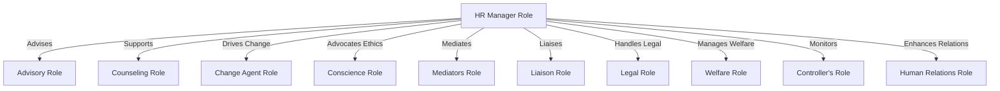

# Role of an HR Manager in an Organization

The primary responsibility of an HR Manager is to manage human resources within an organization. The HR Manager operates in an advisory capacity, providing information, suggestions, counseling, and support to all line managers across the organization. They are not directly accountable for end results. However, within their own department, the HR Manager takes on a line function, overseeing activities and services such as canteens.

The key roles of an HR Manager in an organization are as follows:
<!-- keep heading and content in two different lines -->

 - **Advisory Role**: The HR department maintains functional relationships with other managers throughout the organization. As a specialist, the HR Manager advises functional department heads on various aspects of human resource management, including manpower planning, recruitment, selection, training, performance appraisal, and compensation. They represent management in various organizational relationships and convey workers' concerns, grievances, and opinions to the management. Effective collaboration with line managers requires tactful suggestions and assistance, aiming to gain their confidence and cooperation.

 - **Counseling Role**: HR Managers also act as counselors for employees. They address a range of employee problems related to work, career, supervisors, colleagues, health, family, finances, and social matters. They suggest ways to minimize and overcome these challenges.

3. **Change Agent Role**: HR Managers serve as change agents in the HR domain. To effectively consult, they must be familiar with the organization's evolving needs and business environment. They initiate and drive necessary improvements in human resource policies, offering infrastructure and support for organizational development. They play a significant role in implementing major institutional changes.

4. **Conscience Role**: In their role as conscience keepers, HR Managers advocate for a humanitarian approach. They advise the management on moral and ethical obligations towards employees.

5. **Mediators Role**: HR Managers often mediate conflicts within the organization. They intervene when there are disputes between employees, employee groups, superiors and subordinates, and employees and management. Their mediation helps maintain industrial harmony.

6. **Liaison Role**: As representatives of the organization, HR Managers provide employees with an overall view of organizational operations, particularly during industrial disputes or grievance redressal processes. Similarly, they act as employee representatives, presenting employee concerns to management, especially when trade unions are absent.

7. **Legal Role**: HR Managers handle legal matters, including grievance resolution, dispute settlement, disciplinary cases, collective bargaining, and the interpretation and application of labor laws. They engage with legal experts, file cases in labor courts, industrial tribunals, civil courts, etc.

8. **Welfare Role**: In compliance with regulations such as Section 49 of the Factories Act, HR Managers fulfill the role of welfare officers. They oversee the provision and maintenance of amenities like canteens, hospitals, creches, educational institutions, clubs, libraries, transportation facilities, cooperative credit societies, and consumer stores on behalf of the company.

9. **Controller's Role**: HR Managers assist line managers in the effective implementation of HR policies and programs. Their guidance is vital for monitoring and controlling progress. As representatives of top management, they ensure consistent execution of approved HR policies and procedures across departments.

10. **Human Relations Role**: HR Managers are experts in human relations, aiming to enhance productivity by addressing employees' economic, social, and psychological needs and aspirations. They are challenged to adapt to the rapidly changing dynamics of post-industrial society.

---
