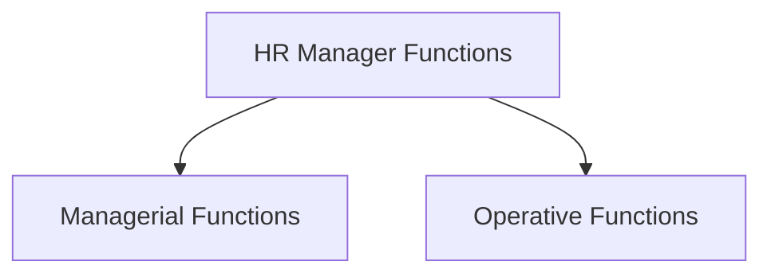

# Functions of HRM

| Managerial Functions      | Operative Functions       |
|--------------------------|---------------------------|
| **1. Planning**         | **1. Procurement**       |
| HRM involves creating a strategic plan for managing an organization's workforce. This includes forecasting future human resource needs, setting goals, and developing strategies to meet those needs. Effective planning ensures the availability of the right talent at the right time. | Operative HRM involves the process of acquiring the right talent for the organization. This includes recruitment, where potential candidates are sourced, attracted, and evaluated for vacant positions. The selection process ensures that the best-fit individuals are chosen to join the workforce. |
| **2. Organizing**       | **2. Development**       |
| In this function, HRM determines the organizational structure and design, including the hierarchy, departments, and reporting relationships. Organizing ensures that the workforce is organized in a way that optimizes efficiency and collaboration.     | Development within operative HRM focuses on enhancing employees' skills and abilities. Training programs are designed to address specific needs and bridge gaps in employees' competencies. Additionally, development initiatives aim to prepare employees for future roles within the organization.   |
| **3. Staffing**         | **3. Compensation**      |
| Staffing involves attracting, recruiting, and selecting qualified candidates to fill vacant positions. HRM ensures that the recruitment process aligns with the organization's requirements and culture, leading to the selection of suitable employees.    | Compensation plays a critical role in attracting, motivating, and retaining employees. Operative HRM is responsible for determining fair and competitive compensation packages, including salaries, bonuses, and incentives that align with the organization's goals and industry standards.    |
| **4. Directing**        | **4. Integration**       |
| Directing involves guiding and leading employees to achieve organizational goals. HRM plays a role in training, motivating, and developing employees, helping them understand their roles and responsibilities and encouraging their professional growth. | Operative HRM facilitates the smooth integration of new employees into the organization. This includes orientation programs to familiarize newcomers with the company's culture, policies, and procedures. Effective integration ensures that employees become productive members of the team quickly. |
| **5. Coordinating**     | **5. Maintenance**       |
| HRM ensures harmony and coordination among different departments and teams. Effective communication, teamwork, and collaboration are facilitated to achieve the organization's objectives.  | Maintenance within operative HRM involves ensuring a positive work environment that promotes employee well-being and job satisfaction. This includes addressing employee concerns, managing conflicts, and providing support to enhance job performance and engagement.    |
