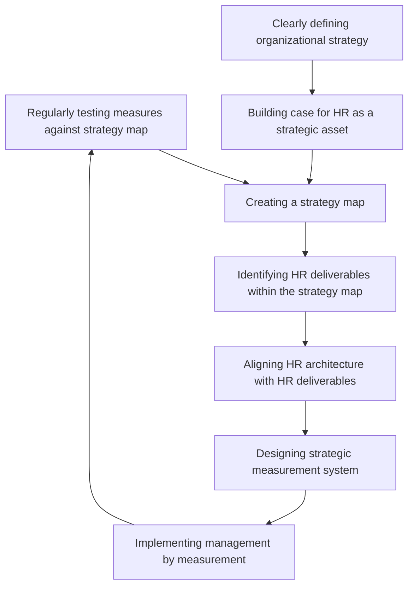

# Strategic Human Resource Management

It is the integration of human resource management with organisation strategies so as to improve human resource perfomance for achieving organisational objectives.

## Features of Strategic Human Resource Management

1. **Linkage between HRM Actions and Business Strategy:**
   SHRM tightly connects HR activities with the organization's overall business strategy. This ensures that HR practices directly contribute to achieving strategic goals. The business strategy influences HR decisions, and vice versa, with human resources and other factors influencing strategy formulation.

2. **Linkage through Strategic Aspects of HRM:**
   SHRM aligns HR and organizational strategies primarily through strategic HR aspects. While each HR function has operational and strategic sides, SHRM focuses solely on strategic dimensions. For instance, in recruiting, strategic aspects involve deciding numbers and qualifications, while operational aspects cover the actual hiring process.

3. **SHRM Functions Performed by Top-level HR Professionals:**
   Strategic HRM tasks are handled by senior HR professionals who possess the necessary expertise and authority. Operational HR functions, however, are executed by lower-level HR staff under their supervision.

4. **Treating Human Resources as Strategic Resource:**
   SHRM treats human resources as a strategic asset. It emphasizes developing the workforce to fulfill crucial strategic roles within the organization. HR practices are tailored to align with the organization's strategic objectives.

## Difference between conventional HRM and strategic HRM

| Dimension of difference     | Conventional HRM      | Strategic HRM        |
|----------------------------|-----------------------|----------------------|
| **Responsibility for HRM** | Staff specialists     | Line managers       |
| **Focus**                   | Employee relations    | Partnership with internal and external customers |
| **Role of HR**              | Transactional, change follower, respondent | Transformational, change leader, initiator |
| **Initiatives**             | Slow, reactive, fragmented | Fast, proactive, integrated |
| **Time horizon**            | Short term            | Short, medium, long term (as necessary) |
| **Control**                 | Bureaucratic roles    | Organic, flexible (whatever is necessary to succeed) |
| **Job design**              | Tight division of labour, independence, specialisation | Broad, flexible, cross training, teams |
| **Key investments**         | Capital, products     | People, knowledge    |
| **Accountability**          | Cost center           | Investment center    |

## Benefits of Strategic Human Resource Management

Strategic Human Resource Management (SHRM) brings forth significant advantages to organizations, achieved through strong alignment between organizational strategies and functional strategies. This linkage results in the following benefits:

1. **Enhanced Human Resource Cost Efficiency:** SHRM sharpens human efforts, leading to more effective utilization of resources. Especially in fields like information technology, where human resource costs are substantial, this efficiency contributes significantly to financial gains.

2. **Informed HR Strategy Formulation:** Strategic plans are grounded in thorough analysis, encompassing the environment, organization, and rationale behind specific strategies. HR managers gain valuable insights from such analyses, aiding them in shaping HR strategies and effective implementation approaches.

3. **Motivated HR Professionals:** The interaction pattern in SHRM fosters constant collaboration between HR professionals, top-level managers, and other functional heads. This engagement stems from the interconnection of HR functions and organizational strategies, elevating job satisfaction among HR professionals.

4. **Elevated Emphasis on Human Resources:** SHRM places paramount importance on human resources as strategic assets. Consequently, organizational HR practices become supportive and nurturing towards employees. This nurturing environment boosts morale, instills meaning into jobs, and encourages individuals to give their best.

## Strategic HRM Tools

In organizations, managers utilize various strategic HRM tools, with three common ones being strategy maps, HR scorecards, and digital dashboards.

### 1. **Strategy Map**
   A strategy map is a concise diagram illustrating the sequence of activities contributing to an organization's strategic goals. It outlines how value is created by linking these activities according to their impact on objectives. Each department, including HR, can gauge its contribution to organizational goals. For instance, if innovation is a key competitive factor, HR identifies relevant employee skills and attitudes for innovative products.

### 2. **HR Scorecard**
   An HR scorecard reports strategically relevant HR metrics aligned with business and HR strategies. Inspired by the balanced scorecard concept, it assesses an organization's performance holistically by integrating financial, customer, internal processes, and learning perspectives with vision and strategies. This empowers HR to emphasize activities vital for business strategy.

### 3. **Digital Dashboard**
   A digital dashboard offers real-time data consolidation, enabling deep business analysis and snapshots of productivity, trends, and key performance indicators on managers' computers. HR managers access up-to-date HR-related insights promptly, enhancing informed decision-making.

These tools in Strategic HRM enhance organizational alignment, informed decision-making, and proactive strategy execution.

## Process of Linking HR Strategy

??? note
    The process of linking HR strategy with organizational strategy is an ongoing one. It involves the following steps:

    ## Seven-step Process of Linking HR Strategy with Organizational Strategy

    1. **Clearly Defining Business Strategy:**
    Crafting an effective business strategy requires a clear and concise plan that those responsible for implementation can comprehend. The inherent complexity of strategy formulation sometimes leads to ambiguity. Organizations are countering this by providing detailed strategy explanations, elucidating its purpose and implementation, ensuring that those executing it are well-informed.

    2. **Making Case for HR as a Strategic Asset:**
    While Strategic Human Resource Management (SHRM) emphasizes HR's strategic value, many organizations primarily prioritize financial and physical resources in strategy. Advocating HR as a strategic asset is pivotal. HR leaders play a crucial role in convincing top management of HR's contribution to strategic success.

    3. **Creating a Strategy Map:**
    A strategy map visually outlines how an organization's resources translate into tangible outcomes linked to objectives. Intervening results (like product, market, or employee-related outcomes) drive the strategy's success. The map identifies critical result areas vital for achieving organizational goals.

    4. **Identifying HR Deliverables within the Strategy Map:**
    Pinpointing HR deliverables in the strategy map is essential for addressing people-related variables that drive HR management objectives. These deliverables encompass performance drivers (e.g., employee productivity) and enablers (methods supporting drivers). HR professionals delineate both on the strategy map, aligning them with the organization's performance drivers.

    5. **Aligning HR Architecture with HR Deliverables:**
    Aligning HR architecture with HR deliverables ensures that they receive pertinent support. This architecture spans from HR functions to employee behavior. Administrative functions are generally outsourced in strategic HR approaches, and the focus shifts to strategic HR functions, necessitating strategic competencies for HR professionals.

    6. **Designing Strategic Measurement System:**
    A strategic measurement system gauges the relevance and accuracy of HR deliverables against organizational strategy requirements. It assesses if these deliverables are progressing as intended. Specific indicators are established in various areas such as recruitment, retention, turnover, and competency development to evaluate performance.

    7. **Implementing Management by Measurement:**
    Management by measurement involves regular monitoring of selected indicators. It ensures that HR strategies are effectively advancing organizational goals. If discrepancies arise, corrective measures are promptly implemented to rectify the course.

