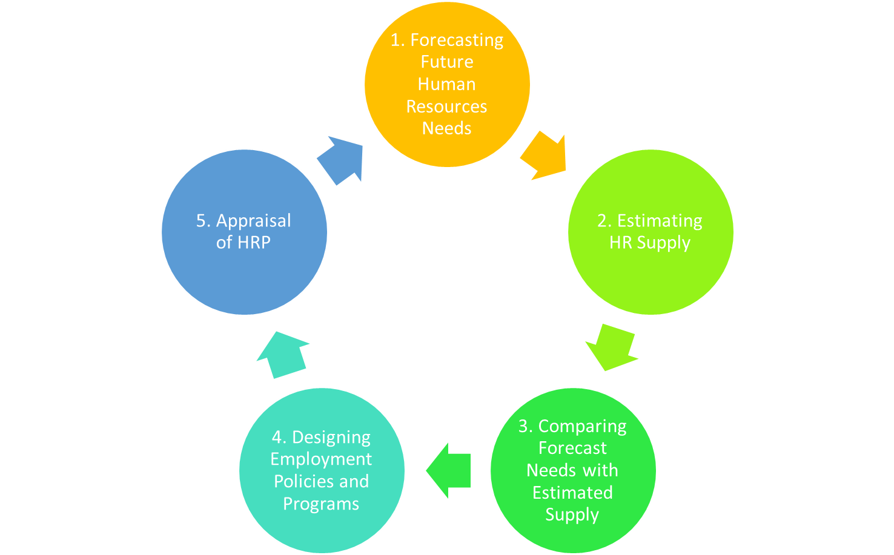

# Steps in the Human Resource Planning (HRP) Process

Human Resource Planning (HRP) is a systematic and methodical approach to managing an organization's workforce. It involves several important steps to ensure that an organization has the right quantity and quality of human resources to meet its objectives. Below are the key steps in the HRP process:

<!--  -->

## 1. Forecasting Future Human Resources Needs

The first step in HRP is forecasting the future human resources needs of the organization. This involves estimating the quantity and quality of employees required to achieve the organization's objectives. Factors such as the scale of production, technological advancements, marketing requirements, financial needs, and job-specific tasks are considered to determine the demand for human resources. Demand estimation should be flexible to accommodate changes in business operations.

## 2. Estimating HR Supply

Once the demand for human resources is determined, the next step is to estimate the supply of available talent. This involves examining the existing workforce and identifying potential sources of talent. The analysis should consider factors such as current employees who may continue with the organization, employee movements within the organization (transfers and promotions), and external sources of recruitment. A realistic supply estimate is essential, with flexibility to make marginal adjustments as needed.

## 3. Comparing Forecast Needs with Estimated Supply

In this step, the organization compares the forecasted needs for human resources (demand) with the estimated supply of talent. The goal is to identify any gaps or surpluses in the workforce. If there is a shortfall in the supply of talent to meet the demand, the organization may need to consider recruitment, training, or other strategies to bridge the gap. Conversely, if there is an excess supply of talent, workforce reduction or redeployment strategies may be necessary.

## 4. Designing Employment Policies and Programs

Once the organization has a clear understanding of its future human resources needs and how they align with the estimated supply, it can design employment policies and programs. This step involves identifying the sources of recruitment for the required workforce and incorporating them into the HRP. Alternative recruitment sources should be identified for quick selection of talent. Additionally, policies related to recruitment, training, career development, and retention should be integrated into the HRP.

## 5. Appraisal of HRP

The final step in the HRP process is the appraisal of the human resource planning efforts. This involves evaluating the effectiveness of the HRP process, identifying any shortcomings or areas of improvement, and making necessary adjustments for future planning cycles. Regular appraisal ensures that the organization's human resource needs are continuously met and aligned with its strategic goals.

In summary, HRP is a systematic process that involves forecasting future human resources needs, estimating HR supply, comparing demand with supply, designing employment policies and programs, and ongoing appraisal. By following these steps, organizations can ensure they have the right talent in place to achieve their objectives and respond effectively to changing business conditions.
