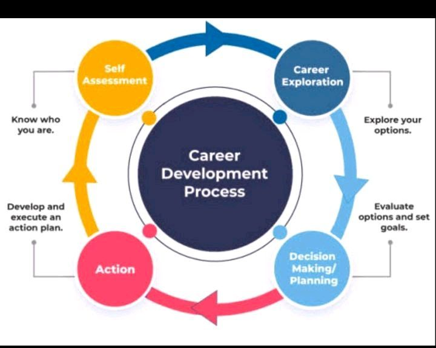

# Career Planning Process

Career planning is a continuous process of setting individual professional goals and devising strategies to achieve them. It enables individuals to understand their skills, interests, and the available career opportunities to make informed decisions. Below is a breakdown of the career planning process steps accompanied by a visual representation of the process.

{ width=55%}

## Step 1: Decide Your Goal

At this initial stage, individuals should clearly define their short-term and long-term career goals. Understanding what you want to achieve professionally will guide the subsequent steps in the career planning process.

## Step 2: Assess Your Skills and Interests (Self-Evaluation)

This step involves a thorough self-assessment to identify your skills, strengths, weaknesses, interests, and values. It's essential to align your career goals with your personal attributes to ensure a fulfilling career path.

## Step 3: Evaluation of Alternatives

Now, explore and evaluate different career alternatives available based on your skills and interests. Conduct research, seek advice from mentors, and consider the pros and cons of each alternative to make an informed decision.

## Step 4: Action

Once you've decided on a career path, it's time to take action. Create a detailed action plan outlining the steps you need to take to achieve your career goals. This may include pursuing further education, gaining relevant experience, or networking within your chosen field.
