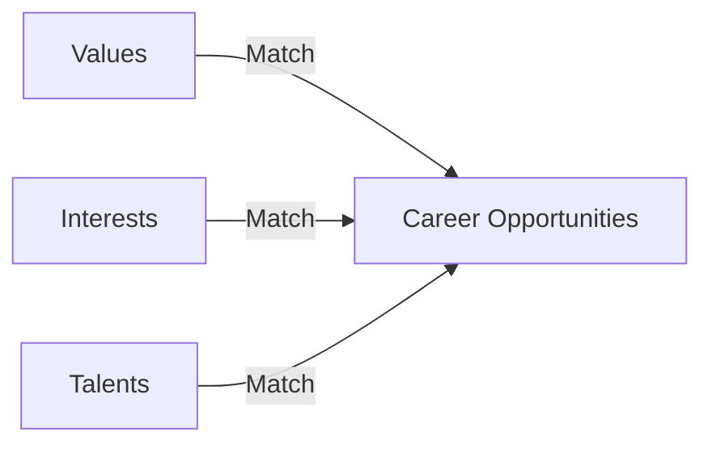
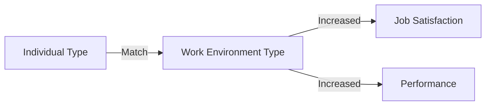
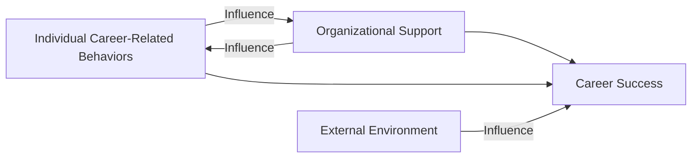
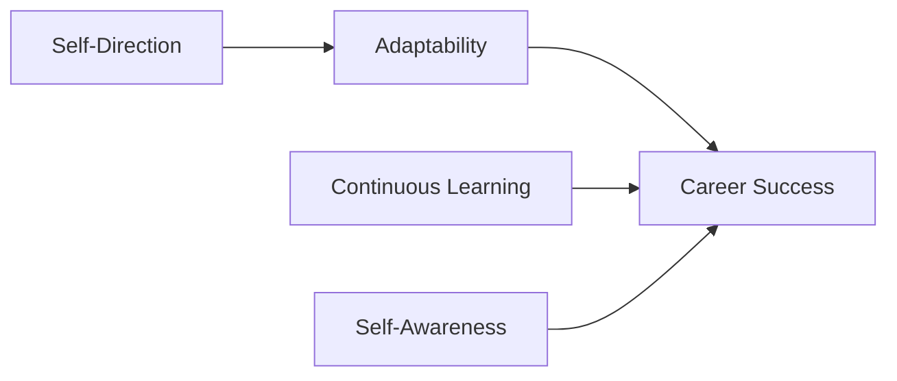

# Models of Career Management

We explore various models of career management. These models help individuals and organizations in planning and developing career paths. They emphasize different aspects like personal interests, abilities, and organizational support to align career goals with personal and organizational objectives.

## 1. Donald's Values-Interests-Talents Model
Donald's Values-Interests-Talents (VIT) Model focuses on aligning an individual's values, interests, and talents with career opportunities. It helps in identifying careers that are not only rewarding but also fulfilling on a personal level.

- **Values:** Core beliefs and principles that drive an individual's behavior and decision-making.

- **Interests:** Subjects or activities that captivate an individual's attention and enthusiasm.

- **Talents:** Innate or acquired abilities and skills that enable an individual to perform effectively.

## 2. Holland Vocational Preference Model
John Holland's model categorizes individuals and work environments into six types: Realistic, Investigative, Artistic, Social, Enterprising, and Conventional (RIASEC). Matching individual and work environment types leads to better job satisfaction and performance.

- **Realistic:** Practical, hands-on occupations.

- **Investigative:** Analytical, intellectual occupations.

- **Artistic:** Creative, unstructured occupations.

- **Social:** Helping, teaching occupations.

- **Enterprising:** Persuasive, leadership occupations.

- **Conventional:** Organized, data management occupations.

## 3. Edward Strong's Inventory Model
Strong's model uses psychometric assessments to measure an individual's interests and match them with various career options. This model helps in making informed career decisions based on personal interests and aptitudes.

- **Psychometric Assessments:** Standardized tests to measure interests and aptitudes.

- **Career Options:** Various professional paths individuals can pursue.

- **Informed Career Decisions:** Choices made based on personal interests and aptitudes.

## 4. Greenhaus Career Development Model
Greenhaus's model emphasizes the significance of organizational support, individual career-related behaviors, and the external environment in career development. It portrays a reciprocal relationship between individuals and organizations in achieving career success.

- **Individual Career-Related Behaviors:** Actions taken by individuals to advance their careers.

- **Organizational Support:** Resources and opportunities provided by organizations for career development.

- **External Environment:** External factors that affect career development.

- **Career Success:** Achieving desired career goals and objectives.

## 5. Protean/Variable Career Model
The Protean Career Model is centered on the individual's self-direction in career management. It highlights the importance of adaptability, continuous learning, and self-awareness in today's dynamic work environment.

- **Self-Direction:** Individuals taking charge of their own career development.

- **Adaptability:** Ability to adjust to changes in the work environment.

- **Continuous Learning:** Ongoing acquisition of new knowledge and skills.

- **Self-Awareness:** Understanding one's strengths, weaknesses, and interests.
