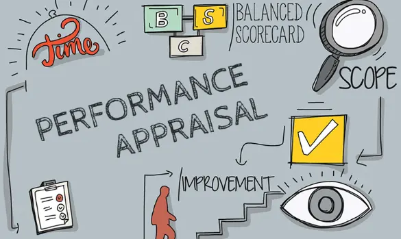

# Performance Appraisal

Performance Appraisal is a systematic evaluation process conducted by an organization to understand the capabilities, achievements, and growth potential of its employees. It involves assessing employee performance against certain predetermined standards to ensure that organizational goals are being met.

## Objectives of Performance Appraisal:

1. **Provide Feedback:** 
    * It provides a platform for managers to give constructive feedback to employees regarding their performance, helping them understand their strengths and areas for improvement.

2. **Improve Communication:** 
    * The appraisal process facilitates better communication between managers and employees, fostering a mutual understanding of job roles, expectations, and performance standards.

3. **Clarify Expectations:** 
    * It helps in clarifying the expectations and performance goals that are required from the employee, ensuring that they understand their job requirements and targets.

4. **Allocate Rewards:** 
    * Performance appraisal aids in recognizing and rewarding employees' efforts and contributions by allocating rewards such as bonuses, promotions, and other incentives based on their performance.

## Purpose of Performance Appraisal:

### Administrative Purpose:

1. Document HR decisions regarding performance and its related issues to ensure that personnel decisions are well *informed and justified.
2. Determine the promotion of employees based on their performance, capabilities, and potential.
3. Determine transfer and change in job assignments to better align employee skills with organizational needs.
4. Identify poor performance areas of employees to address issues and improve productivity.
5. Decide on retention or termination by evaluating employee performance and potential.
6. Decide on layoffs in a fair and transparent manner based on performance metrics.
7. Validate selection criteria by relating performance scores to selection test and interview scores, ensuring the effectiveness of the selection process.
8. Meet legal requirements by maintaining accurate and fair performance records.
9. Evaluate the performance of training programs to understand their impact on employee performance.
10. Plan for changes in HR requirements by assessing current performance levels and identifying future needs.
11. Decide on salary and reward issues by evaluating individual and team performance against set benchmarks.

### Development Purpose:

1. Provide performance feedback to all concerned to foster a culture of continuous improvement.
2. Identify individual performance goals to align employee objectives with organizational goals.
3. Recognize individual performance levels to appreciate efforts and motivate employees.
4. Assist the employees in setting goals to encourage personal and professional development.
5. Evaluate goal achievement of employees to measure success and identify areas for improvement.
6. Identify individual training needs to address performance gaps and enhance skills.
7. Determine organizational training needs to ensure that the workforce is well *equipped to meet organizational objectives.
8. Allow employees to discuss concerns, fostering an open dialogue between employees and management, and working together to address any issues.

Performance appraisal is a holistic process that serves multiple purposes aimed at improving organizational efficiency, enhancing communication, and fostering a conducive work environment for growth and development. Through a well *structured performance appraisal system, organizations can better manage their human resources, align individual performance with organizational goals, and build a motivated and competent workforce.