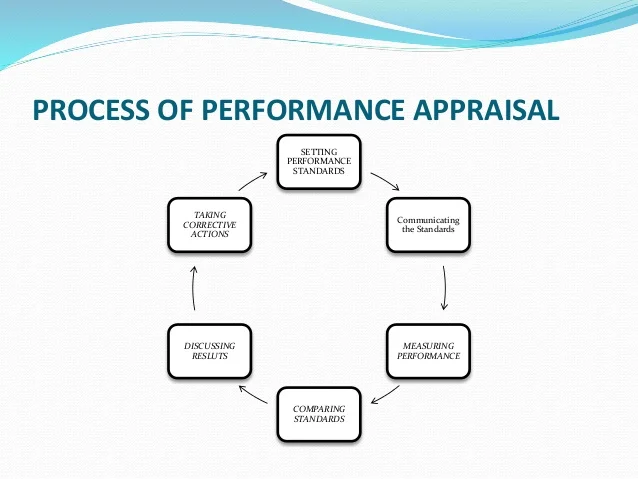

# Process of Performance Appraisal

The performance appraisal process is a structured approach to evaluating and enhancing employee performance. It's aimed at aligning individual performance with organizational goals. Below are the steps involved in the performance appraisal process:

{width=75%}

## 1. Establishing Performance Standards

 The first step in the appraisal process involves setting clear, measurable, and achievable performance standards. These standards are based on the organizational goals, job description, and industry benchmarks. They provide a clear benchmark against which an employee’s performance can be measured.

## 2. Communicating the Standards

 It’s crucial that the performance standards are communicated to and understood by the employees. This communication ensures that employees are aware of the expectations and the metrics on which their performance will be evaluated.

## 3. Measuring the Actual Performance
 This step involves the collection of data on employees' actual performance. Various methods like observation, feedback, and performance data are used to measure performance. The aim is to have an accurate understanding of how well an employee is performing against the set standards.

## 4. Comparing the Actual with Desired Performance
 The actual performance of the employee is then compared with the desired or expected performance standards. This comparison helps in understanding the gaps, if any, and the areas of improvement.

## 5. Discussing Results
 The results of the appraisal are discussed with the employee. This discussion should be constructive, providing feedback on areas of strength and those requiring improvement. It’s an opportunity for a two-way communication where employees can also share their concerns and perspectives.

## 6. Decision Making
 Based on the appraisal results, decisions are made regarding rewards, promotions, training needs, or other actions. This step is crucial as it impacts employee motivation and their future performance in the organization.

The performance appraisal process is cyclical and should be conducted at regular intervals to ensure that employees are on the right track and are contributing positively towards the organizational goals. It's a strategic tool that helps in workforce development, promoting a culture of continuous improvement, and achieving organizational success.