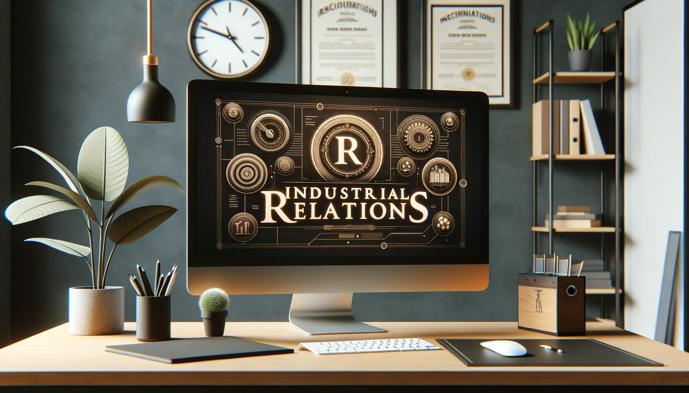

# Industrial Relations

Industrial Relations (IR) is a multidimensional field concerning the relationships and interactions between employers, employees, and the government in a work environment. It is aimed at maintaining a harmonious and productive workplace. The domain of industrial relations encompasses various aspects like employment laws, disputes resolution, and trade union activities among others.

{ width=75% }

## Meaning

Industrial Relations is the study and management of relationships between the workforce and the employers within an organizational setting. It is crucial for creating a conducive work environment and ensuring the smooth functioning of the organization.

- **Employer-Employee Relations:** It encompasses the relationship between employers and employees, and how they interact within a work environment. It involves understanding and managing the expectations, rights, and duties of both parties.

- **Collective Bargaining:** Industrial Relations provides a platform for collective bargaining where trade unions and employers' associations negotiate terms and conditions of employment.

- **Dispute Resolution:** It includes mechanisms to resolve disputes and conflicts that arise in the workplace, ensuring a peaceful and productive work environment.

- **Employment Laws:** Understanding and adhering to employment laws is a significant part of industrial relations. It ensures legal compliance and protection of rights for both employers and employees.

- **Trade Union Activities:** Trade unions play a crucial role in industrial relations. They represent the interests of employees and negotiate with employers to ensure fair treatment and better working conditions.

## Definitions

Several scholars and organizations have defined industrial relations over the years. Below are a couple of definitions:

> The International Labour Organization (ILO) states, "Industrial Relations deals with either the relationship between the state and employers' and workers' organizations or the relations between the occupational organizations themselves."

