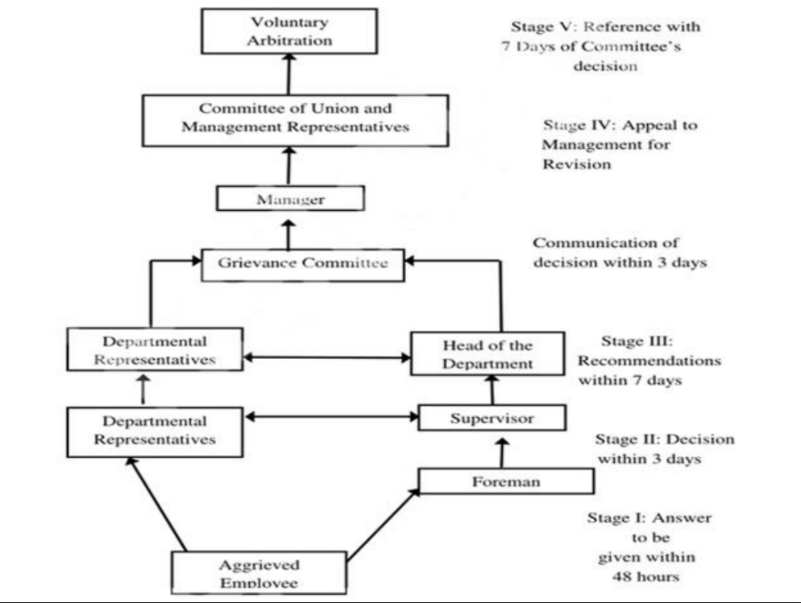

# Grievance Handling Systems

To ensure effective resolution of employee grievances, a systematic approach is essential. Below is a structured grievance handling system that can be adopted in an organizational setting:

The image depicts a flowchart outlining the grievance resolution process within an organization.

## Stage I: Initial Response
- An **aggrieved employee** raises a grievance.
- A **foreman** is expected to provide an initial answer within 48 hours.

## Stage II: Departmental Review
- If unresolved, the issue escalates to a **supervisor**.
- The supervisor must make a decision within 3 days.

## Stage III: Departmental Head Intervention
- The next step involves the **Head of the Department**.
- Recommendations are to be made within 7 days.

## Stage IV: Management Review
- The grievance may then be brought to a **Grievance Committee** including **managerial** and **departmental representatives**.
- **Communication** of the committee's decision is due within 3 days.
- There is also an option for an **appeal to management** for a revision of the decision.

## Stage V: Final Arbitration
- Finally, there may be a **voluntary arbitration** or a **committee of union and management representatives**.
- The committee's decision can be referenced within 7 days after their decision.

The flowchart presents a structured approach to address employee grievances, offering multiple levels of escalation to ensure fair and thorough handling of issues. It reflects the organization's commitment to resolving disputes efficiently and effectively, adhering to specified timeframes at each stage.

## Detailed Grievance Handling Procedure

1. An aggrieved employee shall first present his grievance verbally in person to the
foreman designated by the Management for this purpose. An answer shall be
given to him within 48 hours of the presentation of the complaint.

2. If the worker is not satisfied with the decision of this officer or fails to receive an
answer within the stipulated period, he shall in person or by his foreman, if
required, present his grievance to the supervisor designated by the management
for this purpose. And he will get the answer within 3 days of the presentation of
his grievance.

3. If the decision of the supervisor is unsatisfactory, the aggrieved worker may
request the forwarding of his grievance to the HOD, which shall make its
recommendations to the management within 7 days of the worker's request.

4. The grievance may then be brought to a Grievance Committee including
managerial and departmental representatives. Communication of the
committee's decision to the employee is due within 3 days.

5. A revision of his grievance can be done if the decision is not satisfactory. The
management shall communicate its decision within a week.
    
6. If no agreement is possible the union and the Management may refer the
grievance to voluntary arbitration within a week from the date of receipt by the
worker of the management's decision.