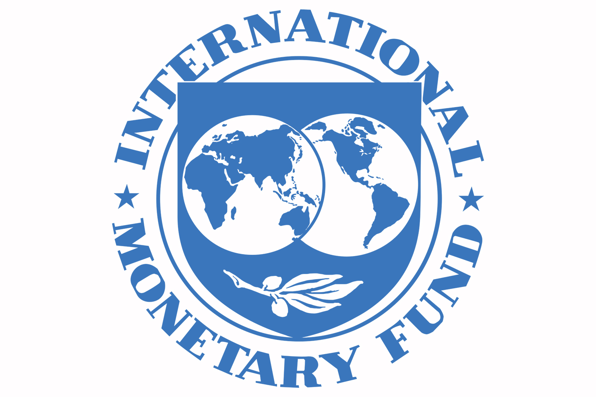

# International Monetary Fund (IMF)

The International Monetary Fund (IMF) is an international organization established in 1944 with the primary goal of promoting global monetary cooperation, ensuring exchange rate stability, facilitating balanced trade among member countries, providing resources to address balance of payments problems, and supporting economic growth and financial stability worldwide.

{width=75%}

## Objectives

The key objectives of the IMF include:

1. **Exchange Rate Stability:** The IMF aims to foster stable exchange rates to facilitate international trade and investment by providing guidance and financial assistance to member countries.

2. **Economic Growth:** It promotes sustainable economic growth by offering policy advice, technical assistance, and financial resources to help countries implement sound economic policies.

3. **Financial Stability:** The IMF monitors global financial markets and helps member countries prevent and manage financial crises by offering financial assistance and policy advice.

4. **Global Economic Cooperation:** It serves as a forum for member countries to discuss and coordinate economic policies on a global scale, addressing issues such as currency exchange rates and monetary policies.

## Functions

The IMF carries out its objectives through various functions, including:

- **Surveillance:** It conducts regular assessments of the global economy and provides policy advice to member countries to ensure economic stability.

- **Financial Assistance:** The IMF provides financial support to countries facing balance of payments problems, often through loan programs with conditions aimed at restoring fiscal and monetary stability.

- **Technical Assistance:** It offers expertise and technical support to member countries in areas such as tax reform, fiscal management, and monetary policy.

- **Capacity Development:** The IMF helps build institutional and human capacity in member countries to strengthen their economic governance and policy implementation.

## Achievements

Some of the notable achievements of the IMF include:

- **Global Financial Stability:** The IMF has played a significant role in stabilizing the global financial system during times of crisis, including the Asian financial crisis of 1997 and the global financial crisis of 2008.

- **Economic Reforms:** Through its policy advice and financial assistance programs, the IMF has helped many countries implement essential economic reforms, leading to improved economic stability and growth.

- **Research and Data:** The IMF conducts extensive research and provides valuable economic data and analysis, contributing to a better understanding of global economic trends.

## Challenges

Despite its successes, the IMF faces several challenges, including:

- **Policy Implementation:** Ensuring that member countries implement necessary economic reforms can be a challenge, as some countries may resist or delay needed changes.

- **Sovereign Debt Crises:** Managing sovereign debt crises in an effective and equitable manner is a complex and ongoing challenge.

- **Governance and Representation:** Issues related to governance and representation within the organization continue to be a subject of debate among member countries.

## Contributions to India

The IMF has made notable contributions to India, including:

- **Financial Assistance:** India has received financial assistance from the IMF during balance of payments crises, helping stabilize its economy.

- **Economic Policy Advice:** The IMF has provided India with valuable policy advice and technical assistance to support economic reforms and sustainable growth.

- **Data and Research:** India benefits from the IMF's research and economic data, which contribute to informed policy decisions and economic planning.

- **Global Voice:** India has a voice in global economic matters through its membership in the IMF, allowing it to influence and contribute to international economic policy discussions.

---

The International Monetary Fund plays a critical role in promoting economic stability, growth, and cooperation among member countries in an increasingly interconnected world.
